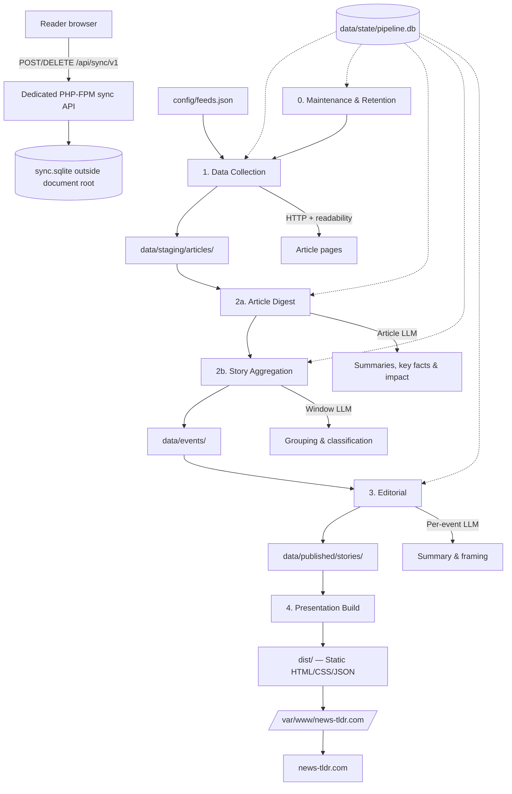

# System Design: news-tldr.com

news-tldr.com is a filesystem-backed RSS aggregator that collects source articles, groups related coverage into durable events, writes neutral TL;DR summaries with political framing transparency, and publishes a CDN-cacheable static site.

## Design Goals

- No database server. Pipeline state uses SQLite (a single file), stage artifacts are JSON, and published news content remains static. The optional anonymous reader-sync endpoint is a small isolated PHP-FPM/SQLite exception at the origin.
- Every pipeline stage is inspectable: JSON files on disk, SQLite queryable with standard tools.
- Preserve source attribution from collection through presentation.
- Separate data collection, aggregation, editorial, and rendering so each stage can be tested and rerun independently.
- Prefer neutral factual summaries. Surface partisan framing transparently when present, without adopting it.
- Support hourly pipeline runs with incremental processing. Stories evolve as new articles arrive across runs.

## Technology Stack

- **Pipeline**: Python. Libraries: `feedparser`, `httpx` (HTTP/2-enabled collection client and pooled HTTP/1.1 Gemini client), `h2`, `trafilatura` (article extraction), `beautifulsoup4` (custom scrapers), hosted LLM API client (Gemini Developer API by default). SQLite is accessed through Python's standard-library `sqlite3` module.
- **Presentation**: Dependency-free Python renderer in `pipeline/present.py`. Generates static HTML, content-fingerprinted CSS/JavaScript, and JSON from published story artifacts.
- **State**: SQLite database for pipeline state, incremental processing tracking, and fast lookups. JSON files remain the human-readable artifacts for each stage.
- **Reader sync**: Optional same-origin PHP 8.4 endpoint in a dedicated resource-bounded PHP-FPM pool. It stores hashed capability groups and three days of story-ID/read-time state in `/var/lib/news-tldr-sync/sync.sqlite`, separate from pipeline state and outside the document root.
- **Deployment**: The pipeline environment (including the pipeline SQLite database, staging files, and lock states) is never web-accessible. Generated files from `dist/` are copied to the Nginx document root at `/var/www/news-tldr.com/`; the sync API source is installed separately under `/opt/news-tldr-sync/`. The checked-in `deploy/nginx/news-tldr.com` virtual host gives generated HTML a 10-minute freshness lifetime so Cloudflare can serve matching pages from its edge cache. Scheduling remains isolated from the public-facing site.

## High-Level Architecture



## Filesystem Layout

```text
config/
  feeds.json                 # Seed feed list and source metadata.
  categories.json            # Category definitions, IDs, and sort order.
  pipeline.json              # Operational tunables: timeouts, thresholds, retention.
  source-policy.json         # Paywall hints, bias labels, reliability notes.

data/
  state/
    pipeline.db              # SQLite: article index, event mappings, run history, lock state.
    pipeline.lock            # Lock file with timestamp for concurrency control.
  staging/
    articles/YYYY/MM/DD/     # One JSON per collected article.
    fetch-log/YYYY-MM-DD.jsonl
  events/
    <event_id>.json          # One file per durable event with article list and metadata.
  published/
    stories/<event_id>.json  # Editorial story JSON, one per event.
    active-stories.json      # Index of currently active stories for the presentation layer.

pipeline/present.py          # Static renderer and production deployment logic.
server/sync/                 # Origin sync API, SQLite store, cleanup, local router.
deploy/php-fpm/              # Dedicated sync PHP-FPM pool configuration.
dist/                        # Ignored generated static output; only this tree is publishable.
```

Article staging directories use the article's **publish date** (from the feed or page metadata). When publish date is missing or unparseable, fall back to **fetch date** and set a `publish_date_estimated: true` flag in the article JSON. Collection is text-only and does not download publisher images. Historical same-stem image sidecars may remain in existing staging data; cleanup continues to recognize them when deleting their corresponding historical article artifacts.

Each stage owns clear input and output directories. Stages write new files atomically (write to a temp file, then rename), never mutate upstream artifacts, and record enough metadata to explain later decisions.

## Stable IDs

Use deterministic IDs wherever possible.

- `source_id`: short stable slug from `config/feeds.json`, such as `ap`, `reuters`, `ars-technica`.
- `article_id`: SHA-256 hash of the canonical URL. Fallback: hash of `source_id` + feed GUID when canonical URL is unavailable. The chosen input is recorded in the article JSON so collisions can be investigated.
- `event_id`: `YYYY-MM-DD-slug`, where the date is when the event was first observed and the slug is LLM-suggested and code-validated for uniqueness. Example: `2026-05-24-iran-talks-resume`.
- `story_id`: matches the `event_id` of the event it covers. One story per event.

Event IDs should survive title changes, daily reruns, and duplicate articles. The LLM can suggest slugs, but code validates uniqueness against existing events in the state database. On slug collision within the same date, progressively refine the date component: try `YYYY-MM-DD-HH-slug`, then `YYYY-MM-DD-HHMM-slug`, until unique. All IDs (`source_id`, `article_id`, `event_id`) must be strictly sanitized to strip directory traversal sequences (like `../`) and invalid characters before being used in file paths.

Events can carry an optional `thread` tag (e.g., `iran-conflict-2026`) for linking related events over time. Threads are free-form metadata strings, not a separate registry. The presentation layer can use thread tags to build "related coverage" links.

## Stage 0: Maintenance & Retention

The completed local pipeline starts with an idempotent maintenance stage before collection. It is exposed as:

```bash
./.venv/bin/python -m pipeline.cli maintenance --verbose
```

Responsibilities:

- Advance event lifecycle state from `active` to `stale` after `aggregation.stale_threshold_hours` without updates, and from `stale` to `archived` after `retention.archived_event_days`. Archived events are excluded from active-event aggregation context.
- Expire old unassigned, unfiltered articles outside the default current/previous-day aggregation horizon by setting `aggregation_status = filtered_expired` and `is_filtered = 1`. The article rows remain in SQLite for auditability and dedup/source history.
- Reconcile active/stale event artifacts against SQLite by rebuilding `article_ids`, `article_count`, status, event path, keywords, and newsworthiness from current unfiltered article assignments. Empty active/stale events are deleted from SQLite and `data/events/`.
- Compact old article JSON only when the article is already filtered or belongs to an archived event: remove `content_text`, keep a compact `content_excerpt`, preserve digest/source metadata, and record `content_text_compacted_at`.

The stage records its own `pipeline_runs` entry, supports `--dry-run`, and uses `--verbose` progress output to stderr. The top-level `run` command executes maintenance under the shared pipeline lock before `collect`, `digest`, `aggregate`, `editorial`, and presentation/publish.

## Stage 1: Data Collection

Inputs:

- `config/feeds.json`, the seed RSS/Atom feed list and scraper targets
- RSS/Atom feeds (HTTP)
- HTML homepages for Custom Scraper targets
- Article pages when feed entries have partial content

Responsibilities:

- Fetch each feed with conditional headers (`If-Modified-Since`, `ETag`) where supported. The pipeline bypasses robots.txt checks for feed URLs configured by the operator but strictly enforces robots.txt for all article page fetches.
- Parse publication time, updated time, headline, summary, feed content, GUID, canonical URL, author/byline, tags, and source metadata. Configure the XML parser (`feedparser` / `lxml`) to disable external entity expansion and DTD processing to protect against XXE injection and XML bomb DoS attacks.
- Fetch full article text when feed content is incomplete, using HTTP GET with readability-style extraction (`trafilatura` or similar). Feed content is deemed incomplete if it is less than 600 characters, equal to the summary, or not substantially longer than the summary (less than or equal to `len(summary) + 200` characters). Extraction should favor recall for full article coverage, fall back through alternate extractor modes, and keep the existing feed text when page extraction does not improve on it.
- Ignore image metadata and media enclosures in feeds, scraper results, and article pages; do not issue image requests or store image metadata in article JSON.
- Detect likely paywalls and store a `paywall` flag with supporting signals.
- Normalize text enough for downstream processing while preserving raw source fields.
- Store one JSON file per collected source article.
- Record each collected article in the pipeline state database for incremental processing.
- Skip articles already recorded in the state database (deduplicate by `article_id`).

### Stage 1 Implementation

The collection implementation lives in the `pipeline` Python package:

- `pipeline/cli.py`: command-line entrypoint. `./.venv/bin/python -m pipeline.cli init-db` initializes the state database, `./.venv/bin/python -m pipeline.cli run --verbose` runs maintenance through production publish under one full-duration pipeline lock, `run --dry-run` performs a non-mutating/no-network/no-LLM preflight, individual stage commands expose focused controls, and `clean-data --yes` removes local generated pipeline state for a fresh run.
- `pipeline/state.py`: SQLite schema and migration entrypoint. The schema includes feeds, feed conditional request state, articles, article fingerprints, events, pipeline runs, item errors, and LLM usage.
- `pipeline/lock.py`: atomic lock file acquisition/release with PID and Linux process start-time verification, plus stale-lock recovery based on the configured watchdog timeout.
- `pipeline/http_client.py`: async HTTP client with browser-like desktop Chrome request headers, per-domain rate limiting, robots.txt and crawl-delay enforcement, retry/backoff handling, and manual redirect validation.
- `pipeline/security.py`: SSRF guardrails. Every initial URL and redirect target is restricted to `http`/`https`, resolved before fetch, and rejected when it maps to loopback, private, link-local, multicast, reserved, unspecified, or blocked-port destinations.
- `pipeline/collect.py`: feed collection, feed parsing, scraper engine routing, article extraction, paywall signal detection, article JSON writes, database registration, and fetch-log writes.
- `pipeline/scrapers/`: modular engine for custom site scrapers (e.g., AP News, MotorTrend) that generate synthetic feed entries using `beautifulsoup4` when standard RSS feeds are unavailable.

Collection writes article JSON under `data/staging/articles/YYYY/MM/DD/` and appends run logs to `data/staging/fetch-log/YYYY-MM-DD.jsonl`. The SQLite database stores only state/index fields plus JSON metadata needed by later stages; full extracted article text remains in the staging JSON.

Collection also records durable per-source run accounting in `source_run_stats`, one row per `run_id` and `source_id`. These rows track feed status, feed HTTP status, entries seen, articles written, synced existing articles, old/duplicate skips, article failures, and collection error counts. Legacy image outcome columns remain in the schema for historical compatibility and stay zero for new runs. Articles store `collection_run_id`, allowing source-health analysis to join collection behavior to later digest and aggregation outcomes (`is_filtered`, `aggregation_status`, `event_id`) without parsing fetch-log JSONL.

The HTTP client sends a desktop Windows Chrome user-agent plus common browser navigation headers (`Accept`, `Accept-Language`, `Sec-Fetch-*`, cache headers, and `Upgrade-Insecure-Requests`) while retaining RSS/Atom/XML-compatible accept values. It does not use a headless browser, login cookies, or paywall bypass behavior.

### HTTP Client Policy

- **User-Agent**: Use a current desktop Windows Chrome UA string. Update the UA string periodically (at least monthly) to track current Chrome stable releases. Illustrative example (the exact version tracked in `pipeline/http_client.py` may be newer): `Mozilla/5.0 (Windows NT 10.0; Win64; x64) AppleWebKit/537.36 (KHTML, like Gecko) Chrome/148.0.0.0 Safari/537.36`.
- **Rate limiting**: Enforce a per-domain delay between requests (default: 1 second). Track last-request-time per domain in memory during a pipeline run.
- **Backoff**: On HTTP 429 or 5xx responses, use exponential backoff (initial 5s, max 60s, 3 retries). Retry status is emitted through the same optional verbose progress callback as collector status, keeping non-verbose stdout/stderr machine-friendly. After max retries, log the failure and move on.
- **Robots.txt**: Respect `robots.txt` directives and `Crawl-delay` when present. Cache robots.txt per domain for the duration of a pipeline run.
- **Timeouts**: Connection timeout 10s, read timeout 10s, and total decoded download timeout 15s. Configurable through `config/pipeline.json`.
- **Concurrency**: Fetch feeds and articles concurrently. Defaults are set high (100 for feeds, 1000 for articles) so all domains run in parallel without a blocking global bottleneck, while the async per-domain lock handles rate-limiting.
- **SSRF Protection**: Only fetch `http` and `https` URLs. Resolve each hostname before requesting it and block loopback, private, link-local, multicast, reserved, and documentation IP ranges for both IPv4 and IPv6, including metadata-service addresses such as `169.254.169.254`. Re-run the same validation for every redirect target and abort redirect chains that change to a blocked scheme, host, port, or resolved IP.
- **Response Size Cap**: Stream response bodies and reject any response whose `Content-Length` header or actual decoded byte count exceeds the configured cap (default 25 MiB). The cap defends against OOM from oversized feeds and gzip-bomb decompression. To prevent decompression errors, the client removes stale decompression headers (`Content-Encoding`, original `Content-Length`, `Transfer-Encoding`) before constructing the returned `httpx.Response`; `httpx` may then set a fresh decoded `Content-Length`.
### Feed Config

Entries in `config/feeds.json` include: `source_id`, `source_name`, `feed_url`, optional `site_url`, default category, content/paywall hints, and fetch behavior overrides. Sources can be staged with `"enabled": false`.

The current source catalog contains 69 enabled sources, including the AP News and MotorTrend custom scrapers. `config/source-policy.json` is kept aligned with `config/feeds.json` by `source_id` so editorial stages can resolve source metadata without guessing.

Custom scraper entries use `"feed_type": "scraper"` and a `fetch.scraper_module` value such as `pipeline.scrapers.ap` or `pipeline.scrapers.motortrend`. Scraper module names are restricted to the `pipeline.scrapers.*` namespace at load time. Scrapers must verify that resolved entry URLs stay on the configured `site_url` host and match an anchored article-path pattern so off-site links and unrelated paths are not enqueued. Each candidate anchor must also look like a headline link — either nested inside an `<article>` / `h1`–`h6` ancestor or itself wrapping a heading element — so subscribe/sign-in/site-chrome anchors that happen to share the article path prefix are filtered out. Scrapers return feed-like entries; any legacy `image_url` field they provide is ignored by the collector.

### Article JSON Sketch

```json
{
  "article_id": "sha256-of-canonical-url",
  "source_id": "example-news",
  "source_name": "Example News",
  "url": "https://example.com/story",
  "canonical_url": "https://example.com/story",
  "guid": "feed-guid",
  "headline": "Headline",
  "summary": "Feed summary or extracted lead",
  "content_text": "Extracted article text",
  "llm_digest": {
    "summary": "Neutral factual digest generated from content_text",
    "key_facts": ["Important fact with source-article context"],
    "content_quality": "ok | thin | extraction_noise | paywalled | non_news",
    "study_stage": "preclinical | animal | early_human | trial_phase | approved | observational | lab_bench | unknown",
    "impact": {
      "global": 0.72,
      "category": 0.88,
      "scope": "local | regional | national | international | niche",
      "novelty": "breaking | update | analysis | evergreen | low_signal",
      "rationale_codes": ["public_safety", "economic_impact"]
    },
    "generated_at": "2026-05-24T12:50:00Z",
    "model": "gemini-3.5-flash-lite",
    "prompt_version": "article-digest-v6",
    "content_chars_used": 12000
  },
  "published_at": "2026-05-24T12:30:00Z",
  "publish_date_estimated": false,
  "fetched_at": "2026-05-24T12:45:00Z",
  "authors": ["Reporter Name"],
  "tags": ["politics", "iran"],
  "paywall": {
    "status": "none | suspected | confirmed",
    "signals": []
  },
  "content_type": "news | opinion | analysis | review | unknown",
  "language": "en",
  "collection": {
    "feed_url": "https://example.com/rss",
    "run_id": "collection-20260601T120000Z-abc12345",
    "http_status": 200,
    "extractor": "feed | readability",
    "article_id_source": "canonical_url | guid"
  }
}
```

## Stage 2a: Article Digest

Inputs:

- Article JSON files from `data/staging/articles/`
- Article records and fingerprints from the pipeline state database

Responsibilities:

- Generate factual per-article LLM digests as a standalone pipeline step before aggregation.
- Write `llm_digest` into each article JSON with summary, standalone key facts suitable for later editorial summarization, content-quality signal, article-level impact, model, prompt version, timestamp, and input character count.
- Run with bounded parallelism (`digest.concurrency` in `config/pipeline.json`) and a verbose CLI mode that streams progress to stderr while final stats stay on stdout.
- Avoid redundant spend by copying completed digests across exact reprints that share content-text or canonical-URL fingerprints. Headline hashes are not used for digest copying because generic shared headlines can describe unrelated stories.
- Validate impact scores and normalize common model scale mistakes: requested output is `0.0` through `1.0`, but otherwise sensible `1-10` and percentage-like values are converted to the configured decimal scale.
- Clamp contradictory low-signal impact scores after validation using a controlled `rationale_codes` vocabulary and `content_quality`. Cap tiers are layered (the minimum applicable cap per axis wins, with global and category capped independently):
  - `non_news` → both axes capped at `0.10`.
  - `LOW_IMPACT_RATIONALE_CODES` (affiliate, archival_index, gambling, low_public_interest, product_recommendation, promotional, puzzle_guide, recycled_content) → both axes capped at `0.15`.
  - `MULTI_TOPIC_RATIONALE_CODES` (`live_blog`, `newsletter_roundup`) → both axes capped at `0.30`.
  - `VENDOR_ANNOUNCEMENT_RATIONALE_CODES` (`vendor_announcement`) → global capped at `0.55`, category capped at `0.75` (asymmetric: vendor keynotes are legitimate vertical news but should not lead a general homepage). Skipped when any HIGH rationale code (`public_health`, `national_security`, `public_safety`, etc.) is also present.
  - `UNCONFIRMED_INJURY_RATIONALE_CODES` (`unconfirmed_injury`) → global capped at `0.60`; category left alone so the vertical can still rank the story.
  - `content_quality in {thin, extraction_noise, paywalled}` (without a HIGH rationale code) → both axes capped at `0.65`.
- Schema-emit an optional `study_stage` enum on medical/biological/materials research articles (`preclinical`, `animal`, `early_human`, `trial_phase`, `approved`, `observational`, `lab_bench`, `unknown`); `not_applicable`, unrecognized values, and stages attached to uncovered domains such as climate, astronomy, aeronautics, software, or general engineering research are dropped before persistence so the field stays present only when meaningful.
- Reset aggregation status to `pending` when a digest is generated or refreshed, so a changed impact score can make a previously filtered article eligible again.
- Use `gemini-3.5-flash-lite` for the first digest. When category impact is within `digest.filter_review_margin` of the aggregation threshold, or a non-`ok` quality label conflicts with a high-impact rationale, run `article-filter-review-v1` on `gemini-3.7-flash`. Persist the first-pass score/quality/model, final reviewer model, rationale, and both usage records. The reviewer may rescue or drop an article; it is not a one-way promotion pass.

The CLI entrypoint is:

```bash
./.venv/bin/python -m pipeline.cli digest --verbose
```

Optional `--range-start`, `--range-end`, `--limit`, and `--concurrency` flags make the stage practical to debug independently from aggregation. `--force` regenerates current-version digests instead of treating them as completed, which is useful after prompt or validation changes. By default, if no range is specified, the stage starts at the configured staging-retention boundary (three UTC days by default), ensuring that late-arriving articles from recovered feeds are digested before maintenance expires them.

## Stage 2b: Story Aggregation

Inputs:

- Digested, unprocessed article records from the pipeline state database
- Article JSON files from `data/staging/articles/`
- Existing event files from `data/events/`
- `config/categories.json` for valid category IDs

Responsibilities:

- Query the state database for articles not yet assigned to an event.
- Use completed article digests instead of site-provided teaser summaries where available.
- Filter out non-news, promotional/affiliate/product/deals, puzzle/game help, gambling picks, archive/index, video-carousel, and no-substantive-content artifacts before grouping. Remaining low-impact articles are filtered using the article digest's category/vertical impact score and `aggregation.min_category_impact` from `config/pipeline.json`. Filtered articles are marked with `aggregation_status = filtered_*` so completed windows do not rerun forever on intentionally skipped rows.
- Video/carousel exclusion should not rely only on the digest model. Aggregation should also apply deterministic URL/path and collection-signal checks for obvious media pages (for example `/videos/`, `/video/`, gallery/carousel paths, and untitled pages whose extracted text is dominated by video listings) before grouping.
- Deduplicate near-identical exact article reprints (e.g., wire service stories) using content and canonical URL hashes during digest and aggregation stages. Headline and summary hashes remain available in `article_fingerprints` for collection-time near-duplicate suppression, but are not used to short-circuit digest generation.
- Classify each article's content type: news, opinion, analysis, review, or unknown.
- Assign each article to a category from `config/categories.json`.
- Group articles into durable story clusters: either match an existing event or create a new one. A cluster may include multiple angles on the same developing news subject, such as updates, reactions, analysis, and local/international framing. The editorial stage is responsible for separating those angles in the summary. Match using the headline and a brief paragraph summary, not the full article text.
- Maintain event matching metadata (`keywords` and major named entities) for future aggregation context.
- Score each cluster's initial newsworthiness on two axes: global homepage impact and impact within its own category/vertical.
- Update event files and the state database with new article assignments.
- Filter standalone opinion pieces from event creation (opinion articles can be attached to an existing event but should not create one alone).

### LLM Integration for Aggregation

Aggregation uses the Gemini Developer API by default, authenticated with an AI
Studio API key in local `.env` configuration:

```bash
GEMINI_API_KEY=your-ai-studio-api-key
GEMINI_BULK_MODEL=gemini-3.5-flash-lite
GEMINI_REVIEW_MODEL=gemini-3.7-flash
GEMINI_REVIEW_FALLBACK_MODELS=gemini-3.6-flash,gemini-3.5-flash
GEMINI_REVIEW_LITE_FALLBACK_MODEL=gemini-3.5-flash-lite
```

Bulk calls use `gemini-3.5-flash-lite` with minimal thinking. Selective review
and editorial calls use the ordered full-Flash chain 3.7 → 3.6 → 3.5 with low
thinking. A retryable transport, 429, or 5xx failure opens a five-minute
per-process circuit for that tier so concurrent and subsequent calls bypass it.
Deduplication alone may use 3.5 Flash-Lite as a final capacity fallback; Lite
can reject a candidate but cannot authorize a destructive event merge.
If every full-Flash tier returns an empty response for safety-sensitive
editorial input, editorial retries the same full-Flash chain once with compact
digest/key-fact context and records a distinct compact prompt version; it still
never falls back to Lite.
`GEMINI_MODEL` remains a bulk fallback. Calls go through `generativelanguage.googleapis.com` with the
`x-goog-api-key` header and a pooled `httpx` HTTP/1.1 client. Requests omit the
deprecated Gemini 3 sampling fields (`temperature`, `topP`, and `topK`) and use
structured output (`responseMimeType: application/json` plus a JSON schema).
API keys must not be written to logs, command output, JSON artifacts, or
committed files.

Aggregation runs over fixed UTC publish-time chunks with a short overlap lookahead. The default aggregation chunk is 3 hours with an additional 1-hour overlap, so actual LLM windows are 4 hours wide and anchored to UTC boundaries (`00:00-04:00`, `03:00-07:00`, `06:00-10:00`, `09:00-13:00`, `12:00-16:00`, `15:00-19:00`, `18:00-22:00`, `21:00-01:00`). Hourly cron runs keep returning to those same fixed windows rather than shifting the window start based on the current hour or first unassigned article. The default planning horizon matches `retention.staging_article_days` (three days), so late-arriving articles accepted by collection are not outside digest/aggregation coverage. The digest stage should run before aggregation; aggregation then filters non-news/spammy/video-carousel artifacts and articles whose digest category/vertical impact score is below the configured threshold. The state database records completed aggregation windows; normal pipeline runs use sparse planning, selecting only fixed window starts that have unassigned articles in that publish-time bucket, plus the latest completed window when it falls in range. This avoids rerunning every intervening old window when late-arriving articles appear with older publication timestamps. Forced aggregation remains continuous so reset coverage is explicit. For each aggregation window, we load all eligible articles published within those hours (both assigned and unassigned) and send their metadata (headline + digest summary/key facts when available, otherwise collected summary + source + publish date) to the LLM to:

1. Classify each article's content type and category.
2. Group articles into story clusters (matching and referencing existing event IDs where applicable) by identifying multiple outlets and angles reporting on the same developing news subject.
3. Suggest new event IDs and slugs for novel events.
4. Suggest optional `thread` tags for linking related events.

Prompt shape is part of the contract. The first aggregation pass should avoid free-text fields and ask for compact, order-preserving structured output using numeric enum codes rather than copied article IDs. Deterministic code maps each output row back to the input article by position. This reduces malformed JSON, repeated text inside string fields, and ID-copying errors. Event naming, keyword/entity generation, and slug suggestions should happen in a second smaller call after candidate event assignments are known.

#### Category Group Partitioning

To solve LLM laziness and incorrect grouping when a single window contains a large volume of articles (which can exceed 100+ articles in high-traffic windows), the window articles and active events are partitioned into related **Category Groups** before invoking the grouping LLM. Oversized groups are split into bounded batches of at most 50 articles before prompting, preventing attention breakdown and hallucinations.

The predefined category groups are:
- `politics_gov`: `politics`
- `news_business`: `us`, `world`, `business`
- `sci_tech`: `technology`, `science`, `health`, `environment`
- `leisure`: `entertainment`, `automotive`

For each window chunk:
1. Load all eligible window articles.
2. Group the articles by their default categories into the four Category Groups. The high-volume `news_business` group is split first by `us`, `world`, and `business`, then any oversized bucket is chunked to the configured batch maximum.
3. For each non-empty Category Group batch, fetch active events matching the batch categories. The matching set intentionally bridges `politics` with `us` and `world` so civic/political stories from general-news feeds can still attach to political events without combining all those articles into one large grouping batch.
4. Run active event filtering, Gemini story grouping, and newsworthiness scoring separately for each batch. These LLM-only batch jobs run concurrently up to `aggregation.category_batch_concurrency` in `config/pipeline.json` (default: 8). SQLite/event-file writes still happen afterward on the main thread in deterministic batch order.
5. Accumulate token usage, execution times, and counts across all processed Category Group batches to finalize the window's run metrics.

After the grouping response validates, deterministic code also splits weakly connected headline groups into smaller components. Components only inherit an `existing_event_id` when they have enough headline overlap with that active event title (or already contain an article assigned to that event), which prevents broad-keyword clusters from attaching unrelated articles to an existing event. If the model returns an `existing_event_id` that was not offered in the prompt, validation drops that ID instead of failing the whole category batch.

Post-aggregation deduplication runs on every aggregation invocation, including
passes with no new window work, and collects candidate event pairs from four
complementary gates before running the same strict per-pair LLM merge call on
the union. The default 72-hour lookback includes active and stale events for the
complete homepage window:

1. **Slug / title heuristics** — base-slug equality, title-word overlap (`_titles_similar`), and highly similar individual article headlines (catches reprints with different lead facts).
2. **Keyword-overlap gate** (`_keyword_overlap_candidates`) — within a single category-group batch, pairs events that share at least 2 distinctive event-level keywords after stripping a global static stopword list and a per-batch *dynamic* hot-keyword stopword list (`_dynamic_keyword_stopwords`). The dynamic list flags any keyword appearing in ≥20% of the batch's events AND in ≥4 events (an absolute floor that prevents tiny batches from stopwording distinctive entities like "ferrari" that only appear in the 2 candidate duplicates).
3. **LLM pre-screen gate** (`_llm_prescreen_candidates`) — loose-recall LLM calls over category-group batches (`politics_gov`, `news_business_{us,world,business}`, `sci_tech`, `leisure`), sending each event's id, title, top-6 filtered keywords, and top-3 article headlines. The model is instructed to err on the side of inclusion; false positives are filtered by the strict per-pair merge call. Each call is bounded to `DEDUPLICATION_MAX_EVENTS_PER_PRESCREEN_BATCH = 40` events and chunked when batches exceed that. For oversized batches, the top high-article-count anchor events are repeated into every prescreen chunk so large ongoing stories can still be compared with later singleton updates that would otherwise land in a different chunk. `news_business` also gets an additional parent-level cross-category prescreen because market, business, U.S., and world framings often describe the same underlying event from different verticals. All prescreen chunks across all category-group batches share one worker pool up to `aggregation.deduplication_concurrency` (default: 16). Prompt version: `deduplication-prescreen-v1`. Token usage and errors are recorded under stage `deduplication_prescreen`.
4. **Per-pair merge LLM** — for every unique candidate pair from the union of (1)–(3), `_build_event_merge_prompt` decides `should_merge` with confidence ≥ `DEDUPLICATION_MERGE_CONFIDENCE_THRESHOLD` (0.8). Prompt version `deduplication-review-v2` treats immediate reactions, consequences, implementation details, and alternate reporting angles as one evolving homepage story when they share the same core development, while explicitly keeping separate incidents and materially distinct developments apart. This is the single source of truth for actually merging; over-merging risk lives here only. Candidate-pair reviews run concurrently in rounds of disjoint event IDs, then accepted merges are applied serially in deterministic order so one merge cannot race another merge touching the same event. Full-Flash decisions are cached against both event `updated_at` values and the prompt version, so unchanged negative pairs are not paid for or retried every hour. The bounded 40-pair queue orders exact/base-slug and strong title/headline candidates before keyword-overlap candidates, which in turn precede broad LLM-prescreen candidates; recency breaks ties within each confidence tier. This prevents obvious same-headline splits from being crowded out by a burst of newer loose-recall candidates. A changed event invalidates its cached pair decisions automatically.

Over-merging protection comes from the strict per-pair call; recall comes from the diversity of candidate gates. Adding a new gate cannot weaken the merge decision — at worst it adds extra per-pair LLM calls that return `should_merge=false`.

The chunk-plus-overlap approach balances context window limits, cost, latency, and retry blast radius. The hosted Gemini path supports much larger contexts than the local Ollama evaluation, but smaller chunks keep batches under the LLM attention-breakdown threshold and isolate failure blast radius to a single chunk plus overlap.
Matching uses only the headline and a digest/brief paragraph summary, plus compact key facts when available, to keep grouping payloads small and avoid processing full article text inside the grouping call. Full article text stays on disk for digest generation and later editorial passes.

Deterministic code validates all LLM outputs: checks category IDs against `config/categories.json`, enforces event ID uniqueness, and rejects malformed suggestions.

After grouping, aggregation derives event newsworthiness from article-level digest impact scores when available. This avoids an extra LLM call for groups whose articles already have impact metadata. For groups missing digest impact, aggregation can still run a smaller newsworthiness scoring pass over each cluster/singleton. This keeps the grouping prompt focused on "same underlying event" while still capturing editorial ranking signals early. The scoring prompt uses headline, brief summary, source count, article count, and category hint, and returns:

- `global`: importance to a broad general-news homepage.
- `category`: importance within the story's own vertical.
- `rationale_codes`: compact audit tags such as `geopolitical_escalation`, `public_safety`, `economic_impact`, `entertainment_major_release`, or `low_public_impact`.

Scores are normalized from `0.0` to `1.0`, validated by deterministic code, stored in event JSON, and mirrored in SQLite for ranking queries. If digest impact is unavailable and the LLM scoring call fails, is unavailable, or omits a cluster, deterministic baseline scoring is used so every event has a usable signal.

### Stage 2 Implementation

The initial aggregation implementation lives in `pipeline/aggregate.py` and is exposed by `./.venv/bin/python -m pipeline.cli aggregate`. It plans 3-hour aggregation chunks with a 1-hour overlap lookahead (4-hour LLM windows fixed to `00/03/06/09/12/15/18/21` UTC starts), skips completed windows using `aggregation_windows`, loads category-impact-eligible articles in each planned window, calls Gemini with headline + digest/summary metadata in category-bounded batches, validates that every article index appears exactly once, scores resulting groups for newsworthiness from digest impact or fallback scoring, writes `data/events/<event_id>.json`, upserts the `events` table, assigns `articles.event_id`, and records completed windows. Windows remain sequential because each window should see event state from earlier windows; within a window the LLM-only category batch work is concurrent. The command supports `--range-start`, `--range-end`, `--limit-windows`, `--dry-run`, `--force`, and `--verbose`. By default, if no range is specified, aggregation bounds cover the configured staging-retention horizon, while non-force planning sparsely selects only fixed UTC windows that have unassigned articles in their publish-time bucket, plus the latest completed window when applicable. If no unassigned articles exist within this horizon, the run plans no windows but still drains bounded deduplication review work. With `--force`, default planning instead uses completed digests in the same retention horizon, clears prior event assignments and aggregation-stage filter decisions for the actual planned window coverage, deletes or trims affected event artifacts, and then reruns the continuous window range even if windows were previously marked completed.

Event naming in this first pass is deterministic and intentionally simple: existing event IDs are reused when a group contains already-assigned articles; otherwise code derives a stable date + headline slug and stores lightweight keyword metadata. Richer title/slug/entity generation remains a follow-up LLM pass.

Digest regeneration and review on May 25, 2026 (article-digest-v3) verified the layered cap system and controlled-vocabulary rationale codes against a stratified sample (39 across all 11 categories + 6 edge cases). Compared with v2: `paywalled` started being used (0 → 27 articles), `extraction_noise` doubled (23 → 52), `novelty=low_signal` nearly tripled (40 → 116), `novelty=breaking` dropped from 294 → 246 (research papers no longer auto-tagged as breaking), `novelty=analysis` more than doubled (60 → 156), `impact_capped` events roughly quadrupled (~40 → 176) as the new vendor_announcement / multi-topic / unconfirmed_injury / recycled_content rationales started firing, and `study_stage` was populated on 49 research articles with the full enum spread. Asymmetric caps (vendor_announcement, unconfirmed_injury) and HIGH-rationale cap bypass (public_health Ebola wires) were both confirmed working on sampled articles. Known residual minor issues: the date-leak rule against inserting `published_at` year/month/day into the summary is followed most of the time but still drifts occasionally, and one paywalled WaPo article was tagged `thin` despite the prompt explicitly naming "Democracy Dies in Darkness" as a paywall signal (caps still fired correctly via the noise-cap path so downstream behavior is unaffected).

Prompt version `article-digest-v6` includes URL, canonical URL, and estimated-publish-date metadata in the digest prompt; tightens guidance for video, gallery, profile/background, media-transcript, stale estimated-date, and stale archive/background pages; narrows `study_stage` to covered medical/biological/pharmaceutical/materials research; and gives category-impact guidance for legitimate vertical stories whose global impact is low. The digest stage also deterministically filters obvious `/video/`, `/videos/`, `/gallery/`, and `/galleries/` URL paths before LLM calls, filters stale estimated-date pages when URL or live-page text dates are clearly older than the collected timestamp, and drops irrelevant `study_stage` values before writing `llm_digest`. The code-side `study_stage` gate uses word-boundary matching and excludes climate, space, aeronautical, software, paleontology, and general earth-science contexts unless there is a strong biomedical or materials signal.

#### Event Merging and Reassignment

To handle stories that develop over longer periods and span across different 3-hour windows, the system implements a two-layered event merging strategy:

1. **Proactive Active-Events Matching**: During the window aggregation pass, the aggregator queries the SQLite database for events updated within the last 48 hours matching the categories of the window articles. These active events are filtered to only include those whose title shares at least 2 non-stopword words with at least one article's headline in the current window (or shares the single non-stopword if the event title only has one). This prevents context bloat and false-positive groupings in the LLM. The matched active events are passed to the grouping LLM call (containing their IDs, categories, and titles/headlines). The LLM is instructed to assign window articles directly to these existing events where appropriate, returning their `existing_event_id` in the JSON groups response. The validator only preserves event IDs that were actually included in that prompt.
2. **Reactive Post-Aggregation Deduplication**: At the end of every aggregation invocation, a reactive deduplication process runs over active and stale events updated in the configured 72-hour lookback, even when no aggregation window changed. It checks for candidate event pairs using suffix conflicts (e.g. `event-name` vs `event-name-2` date-slug collisions), title word overlaps, highly similar article headlines, distinctive keyword overlap, and an inclusive 3.5 Flash-Lite prescreen. Each unique candidate pair then goes to the strict `deduplication-review-v2` call on `gemini-3.7-flash`, which evaluates full article lists, headlines, and digests. A merge requires both `should_merge=true` and confidence of at least `0.80`.

When a merge is triggered (either proactively via the window LLM or reactively via post-aggregation deduplication), the aggregator selects a winning event ID, loads historical article IDs from both events, merges their article lists, updates the winning event's JSON and database assignments, deletes the merged-away events' JSON files, and removes their SQLite database entries to prevent historical data loss.

Model evaluation notes:

- Local model evaluation on May 24, 2026 found that `gemma4:26b` with `think: false` and compact numeric schema produced valid structured output in about 29 seconds for an 8-article CPU batch, but larger title-clustering experiments were too slow for the pipeline's needs.
- `qwen3.6:27b` with `think: false` produced good structured output but was much slower, about 227 seconds for the same 8-article CPU batch.
- `llama3.1:8b` produced valid structured output but lower classification quality.
- Free-text JSON fields and calls without local-model thinking controls caused empty responses, looping, malformed JSON, or poor reliability in local tests.
- August 24, 2026 live structured-output smoke tests succeeded for `gemini-3.5-flash-lite` and `gemini-3.7-flash`. A curated comparison found that 3.7 added useful judgment on some borderline article-impact decisions but also shifted scores in both directions; it is therefore used only for near-threshold/conflicting article-filter decisions and strict final event-pair adjudication. Bulk digestion, grouping, scoring, and dedupe candidate discovery remain on 3.5 Flash-Lite.

### Event JSON Sketch

```json
{
  "event_id": "2026-05-24-iran-talks-resume",
  "title": "Talks resume after overnight strikes",
  "category": "world",
  "thread": "iran-conflict-2026",
  "keywords": ["iran", "talks", "strikes"],
  "entities": [
    {
      "name": "Iran",
      "type": "place"
    }
  ],
  "created_at": "2026-05-24T12:45:00Z",
  "updated_at": "2026-05-24T18:30:00Z",
  "status": "active",
  "article_ids": [
    "sha256-abc123",
    "sha256-def456"
  ],
  "article_count": 2,
  "confidence": 0.86,
  "newsworthiness": {
    "global": 0.82,
    "category": 0.91,
    "rationale_codes": ["geopolitical_escalation", "multi_source"],
    "scored_at": "2026-05-24T18:31:00Z",
    "model": "gemini-3.5-flash-lite",
    "prompt_version": "newsworthiness-v1"
  }
}
```

Event `status` values:

- `active`: received new articles within the staleness threshold (default: 48 hours, configurable via `stale_threshold_hours` in `config/pipeline.json`).
- `stale`: no new articles beyond the staleness threshold. Still visible on the site but deprioritized.
- `archived`: older than the configured retention window. Excluded from active story generation.

## Stage 3: Editorial

Inputs:

- Event files with updated article lists (events that gained new articles since last editorial run)
- Source article JSON files for those events
- `config/source-policy.json` for bias/reliability metadata

Responsibilities:

- Generate one neutral TL;DR story per event.
- Include the important facts, relevant uncertainty, and known missing context.
- Attribute claims to source articles without copying article prose.
- For clearly political events where sources frame the story in divergent ways, extract left-perspective and right-perspective summaries with source attribution.
- Rank stories by importance using the Stage 2 newsworthiness scores plus freshness, source quality, source count, and editorial judgment.
- Write or update story JSON files.
- Update `data/published/active-stories.json` with the current set of active stories.

### LLM Integration for Editorial

Editorial LLM calls are **per-event**. Each call receives:

- The event metadata (title, category, article count).
- Full text (or substantial excerpts) of all source articles for that event.
- Source policy metadata (bias labels, reliability) for each source.
- Instructions for neutral summarization and political framing extraction.

Each event is a separate LLM call because the model needs the full article context to produce accurate summaries and detect framing. Grouping multiple events into one call would exceed context limits and reduce quality.

### Editorial Rules

- Prefer "what happened, who is affected, what changed, what remains uncertain."
- Do not amplify unsupported claims because they are repeated.
- Do not infer motive unless sources provide evidence.
- Do not flatten genuine disagreement into false certainty.
- Opinion-only pieces can be cited as examples of reaction/framing but should not drive the story's factual claims.

### Political Framing

For events in categories likely to have partisan framing (primarily `politics`, `us`, and sometimes `world`), the editorial stage extracts divergent perspectives:

- The TL;DR and key facts remain **neutral**.
- A `political_framing` section surfaces clearly left-leaning and clearly right-leaning source perspectives with brief summaries of how each side frames the story.
- Sources are attributed to each perspective based on `config/source-policy.json` labels and article-level framing analysis.
- This section is **only present** when meaningful divergence exists. Do not force framing onto non-political stories or stories where sources largely agree.

The goal is transparency: readers see the neutral summary AND can optionally see how partisan outlets are spinning the story.

### Published Story JSON Sketch

```json
{
  "story_id": "2026-05-24-iran-talks-resume",
  "event_id": "2026-05-24-iran-talks-resume",
  "category": "world",
  "thread": "iran-conflict-2026",
  "headline": "Talks resume after overnight strikes",
  "dek": "Negotiators returned to talks as officials reported new strikes and disputed casualty counts.",
  "tldr": [
    "Negotiators resumed talks on Sunday after overnight strikes.",
    "Officials gave different accounts of the damage and casualties.",
    "The next scheduled diplomatic step is expected later this week."
  ],
  "key_facts": [
    {
      "text": "Talks resumed on May 24, 2026.",
      "source_article_ids": ["sha256-abc123"]
    }
  ],
  "uncertainties": [
    {
      "text": "Casualty figures remain disputed across sources.",
      "source_article_ids": ["sha256-abc123", "sha256-def456"]
    }
  ],
  "political_framing": null,
  "sources": [
    {
      "article_id": "sha256-abc123",
      "source_name": "Reuters",
      "headline": "Talks restart after strikes",
      "url": "https://reuters.com/..."
    }
  ],
  "importance": {
    "score": 0.82,
    "signals": ["multiple_sources", "fresh", "international_impact"]
  },
  "created_at": "2026-05-24T15:00:00Z",
  "updated_at": "2026-05-24T19:00:00Z",
  "llm_metadata": {
    "model": "model-name",
    "prompt_version": "editorial-v1",
    "generated_at": "2026-05-24T19:00:00Z"
  }
}
```

When political framing is present:

```json
"political_framing": {
  "summary": "Coverage diverges on whether the strikes were proportionate.",
  "left_perspective": {
    "summary": "Coverage emphasizes civilian casualties and questions the military rationale.",
    "source_article_ids": ["sha256-ghi789"]
  },
  "right_perspective": {
    "summary": "Coverage emphasizes security threats and frames the strikes as a necessary response.",
    "source_article_ids": ["sha256-jkl012"]
  }
}
```

### Active Stories Index

`data/published/active-stories.json` is a lightweight index regenerated each pipeline run:

```json
{
  "generated_at": "2026-05-24T19:00:00Z",
  "stories": [
    {
      "story_id": "2026-05-24-iran-talks-resume",
      "category": "world",
      "headline": "Talks resume after overnight strikes",
      "importance_score": 0.82,
      "source_count": 5,
      "event_created_at": "2026-05-24T12:45:00Z",
      "event_updated_at": "2026-05-24T18:30:00Z",
      "created_at": "2026-05-24T15:00:00Z",
      "updated_at": "2026-05-24T19:00:00Z"
    }
  ]
}
```

The presentation layer reads this index to decide which stories to render and how to order them, then reads individual story JSON files for full content. The presentation layer owns the time window (e.g., "last 24 hours", "last 48 hours") and filtering logic. Rolling news windows use `event_updated_at`; story `created_at`/`updated_at` describe editorial artifact generation and must not make an old event appear newly reported after a forced regeneration.

The index also carries a validated `curation` object generated once per editorial
run from the rolling-window story headlines, deks, ranks, source counts, and
event ages. Prompt version `homepage-curation-v5` selects up to 12 distinct Top
News story IDs from a compact global high-rank candidate set, favoring
consequential developments from the last 12–24 hours. Topic grouping runs once
over the 100 highest category-ranked candidates per category, so a large 72-hour
corpus cannot create repeated headings across arbitrary chunks. It prefers
coherent sections of at least three stories and may broaden an overly narrow
label to a meaningful regional or subject desk. Those results are merged into
one ordered list of specific multi-story topic sections. A story may
belong to at most one topic section; unmatched stories are intentionally left
for the presentation layer's per-category remainder sections. The curation artifact
stores model/prompt/timestamp provenance and LLM usage is recorded under
`homepage_curation`. A failed category chunk is recorded and omitted without
discarding successful chunks; a pass-wide failure falls back to the ranked Top
News list with no forced topic groups. Editorial generation and publishing
therefore remain available during model failures.

The index also carries presentation ranks refreshed whenever Editorial rebuilds
the index. `homepage_rank_score` weights global impact most heavily, while
`category_rank_score` weights the event's category impact most heavily. Both
reserve 20% for freshness derived from `event_updated_at` and include editorial
judgment plus source quality/coverage. The All view is emitted in homepage-rank
order; the client re-sorts a selected category by its category rank. This keeps
forced story regeneration timestamps from affecting news freshness and lets a
high-impact vertical story lead its own section without necessarily leading the
general briefing.

### Stage 3 Implementation

The editorial implementation lives in `pipeline/editorial.py` and is exposed by
`./.venv/bin/python -m pipeline.cli editorial`. Normal runs select active or stale
events whose `updated_at` is newer than `last_editorial_at`; `--force` regenerates
unchanged stories, `--limit` bounds an evaluation batch, and repeatable
`--event-id` arguments select exact events. The top-level `run` command invokes
editorial after aggregation while retaining the shared pipeline lock.

Each event is one `gemini-3.7-flash` structured-output call using prompt version
`editorial-v2` and low thinking. Politically eligible mixed-source events use the
explicit framing-decision variant `editorial-framing-v1`. Article context is bounded per article and per
event by `config/pipeline.json`, while all source records remain available for
citation. The article query always requires `is_filtered = 0`. Generated key
facts and uncertainties must cite at least one article ID offered in that call;
unknown IDs fail validation rather than reaching published JSON.

Political framing is eligible only for `politics`, `us`, or `world` events that
contain both a left/center-left and a right/center-right source according to
`config/source-policy.json`. Those calls must return an explicit framing-presence
decision; meaningful divergence is still required and the section may be omitted.
Deterministic validation restricts each
perspective's citations to the matching source-policy side.

Importance is an auditable weighted score combining Stage 2 global (50%) and
category (15%) newsworthiness, editorial judgment (15%), freshness (10%), source
quality (5%), and distinct source count (5%). Components and audit signals are
stored with the score. Story files are written atomically before the event's
`last_editorial_at` checkpoint advances. Per-event failures are logged and remain
eligible for the next incremental run. The active index includes story artifacts
for both active and stale events, ranked by importance; archived events are omitted.

## Stage 4: Presentation

Inputs:

- `data/published/active-stories.json`
- Individual story JSON files
- `config/categories.json`

Responsibilities:

- Build static pages from story JSON with the standard-library renderer in `pipeline/present.py`. All JSON strings are treated as untrusted and HTML-escaped; external links are restricted to HTTP/HTTPS URLs and raw upstream HTML is never rendered.
- The main page shows all active stories in a **rolling time window**, editorially ranked by importance. Category tabs (one per category from `config/categories.json`, plus an "All" default) filter the same ranked list client-side — they are not separate pages with independent layouts.
- Category navigation uses the optional concise `short_name` from category
  config so all sections fit in one desktop row; full names remain in story
  labels and metadata. The category row and Latest Briefing controls share one
  sticky toolbar so their relative height needs no fixed positioning offset.
  Changing the selected category scrolls to the page top and respects the
  browser's reduced-motion preference.
- A device-local New/All control supports repeat reading. An Intersection
  Observer records a story after its title remains at least 60% visible for one
  second. Local storage retains those story IDs for three days and cards show a
  subtle read indicator. New is the default, and the selected New/All preference
  is global across visits and category sections. Cards remain in place while the
  reader scans the current view; category and New/All changes re-apply the live
  read set so newly read cards disappear from the next New view. A header action
  marks every currently visible card read. The masthead count is always the live
  unread total for the selected category and source-coverage filters, independent
  of New/All, and decrements immediately as titles become read. All always restores the complete
  rolling window. Reading history remains device-local unless the reader
  explicitly enables anonymous synchronization from the masthead control.
- Anonymous sync uses a shareable fragment capability (`#sync=v1.<token>`).
  The browser stores the 256-bit token locally, immediately removes imported
  fragments from the visible URL, handles both initial-load and same-document
  `hashchange` navigation, and uploads the newest 2,000 retained reads. Each card
  carries a stable order composed from the story artifact's immutable first-publication
  timestamp and story ID. A contiguous read prefix within the retention window is
  collapsed into one `read_before` watermark; only out-of-order reads after that
  boundary remain individual ID/timestamp entries. Initial page display waits for
  one bounded revision check and renders once with merged state only when the
  server revision differs from the revision saved by this browser.
  Later writes are debounced by four seconds and ignore the returned union, so
  they never rerender the current view. Focus, tab, online, and cross-tab storage
  events do not pull; a later page visit obtains the latest shared state.
  Server and device state form a grow-only union within the three-day retention
  window; the newest timestamp wins. Disconnecting clears only that browser's
  token, while the separate delete action removes shared server state.
- An independent device-local Top/All source-coverage control composes with the
  category and New/All filters. Top is the default and requires at least two
  distinct sources according to the active story index's `source_count`; All
  restores single-source stories without changing their editorial rank. The
  preference uses `newsTldrCoverageModeV1`, remains global across category views
  and later visits, and appears in the URL only as the non-default
  `coverage=all` state.
- The compact homepage status line combines the visible count with a semantic
  build-time `<time>` element. Same-origin JavaScript converts its ISO timestamp
  to the card-style `Updated Xm/h/d ago` label and refreshes it once per minute,
  so a static page still communicates its current age without a server runtime.
- The homepage renders the curated Top News list first in the All view, then
  multi-story topic sections, then per-category remainder sections such as More
  World News and More Science. Top News cards are removed
  from their repeated topic position in All but keep their topic assignment in
  focused category views. Empty sections disappear after category/read filtering;
  a topic with fewer than two remaining visible cards is dissolved into its
  category remainder instead of rendering as a singleton. Topic groups are
  ordered by the strongest remaining story rank for the selected view. At mobile widths, all rendered sections begin collapsed behind
  accessible heading buttons with story counts. Readers can toggle one section or
  use the view-level Expand All/Collapse All control; desktop sections remain expanded.
  Curated Top News stories remain in Top News when a focused category is selected.
  Other topic sections are ordered by the strongest story-level coverage signal
  updated within 24 hours. That signal combines logarithmic independent-source
  breadth, the story's share of the active 72-hour source pool for its category,
  and a half-weight capped credit for up to two additional angles per publisher;
  a cubic transform of the existing editorial display rank supplies a bounded
  judgment allowance that stays small for routine coverage and becomes material
  only for stories already assessed as highly consequential.
  This prevents feed-rich categories from winning on raw counts alone while still
  distinguishing broad independent coverage from repeated same-site follow-ups.
- Cards use restrained tinting for visual separation. The All view assigns a
  muted category-family tint: World/U.S. use browns, Politics/Business olives,
  Technology/Science/Environment grays, Automotive blue, Health purple, and
  Entertainment orange. Tint depth depends only on distinct source count, so a
  one-source World story stays effectively white and better-supported coverage
  moves toward tan. Lead/secondary layout does not alter color. Focused
  category views use the original neutral white/tan scale, retaining only the
  small category kicker accent.
- Build individual story pages with TL;DR, key facts, uncertainties, source links, and political framing sections.
- Build an active-story archive plus sitemap, robots, 404, and JSON API files.
  Every HTML page carries `noindex,follow,noarchive` metadata. `robots.txt`
  disallows major search-index crawlers but leaves the wildcard policy allowed
  so social preview agents can retrieve metadata and images. Home, archive,
  404, and story pages include Open Graph/X metadata backed by the checked-in
  1200×630 `site/assets/social-card.png`; story pages use their own headline and
  dek and declare `og:type=article`. All generated pages reference the checked-in
  `site/assets/favicon.ico`, which contains 16, 32, 48, and 64 px versions of a
  simple newspaper mark. Historical pages for archived events remain a future
  enhancement.
- Render source links with paywall indicators and uncertainty notes.
- Output fully static, cacheable HTML/CSS/JSON; the optional reader-sync API is
  isolated from this presentation build and its document root. CSS
  and JavaScript use the first 16 hexadecimal characters of their SHA-256 content
  hash in the filename, so unchanged presentation assets keep a stable URL while
  changed content produces a new URL.
- Apply a strict Content Security Policy. CSS and JavaScript are generated locally and loaded from the same origin, so there are no external assets requiring Subresource Integrity.

### Stage 4 Implementation

`./.venv/bin/python -m pipeline.cli present` builds the presentation and publishes
it by default. `present --build-only` writes only `dist/`; `--publish-dir` accepts
an absolute override for controlled deployments. The top-level `pipeline.cli run`
invokes presentation after a successful editorial stage while retaining the
shared pipeline lock. With `presentation.publish_enabled: true`, that step also
publishes automatically; `run --no-publish` is the explicit build-only escape
hatch.

Presentation settings live in `config/pipeline.json`:

- `site_url`: canonical public origin, currently `https://news-tldr.com`.
- `rolling_window_hours`: homepage event freshness window, currently 72 hours.
- `publish_enabled`: whether ordinary top-level runs deploy after building.
- `reader_sync_enabled`: whether the homepage exposes anonymous sync; keep false
  until the origin API, FPM pool, cleanup cron, and Nginx route are installed.
- `publish_dir`: absolute production document root, currently `/var/www/news-tldr.com`.

The renderer validates the active story index, story IDs, story/category parity,
and source URLs before writing into a temporary sibling directory. It replaces
`dist/` only after the complete build succeeds. The production deploy rejects
relative, broad, symlinked, or source-equal destinations and rejects symlinks or
path traversal in the generated tree. It copies generated assets and story pages
before `index.html`, then records the exact managed path set in
`.news-tldr-managed.json`. Later deploys remove ordinary stale paths from that
manifest and preserve unknown server-managed files. Previous content-hashed CSS
and JavaScript remain managed and available because HTML or browser caches may
legitimately request them during their one-year cache lifetime; the legacy
unversioned paths are also retained for cached HTML during the initial migration.
Public files are written with mode `0644`.

The checked-in Nginx virtual host applies `expires 10m` to `.html` and `.htm`
responses. Nginx emits `Cache-Control: max-age=600` and a matching `Expires`
header, giving browsers and the configured Cloudflare HTML cache rule a bounded
10-minute freshness window. The hourly build remains the source of content;
after the freshness window, caches revalidate against Nginx's `Last-Modified`
and `ETag` validators. Hashed `site.<fingerprint>.css` and
`site.<fingerprint>.js` responses receive a one-year `Expires`/`max-age` policy
plus `immutable`; a content change creates a new URL instead of invalidating an
existing cached response.

The initial production publish on August 24, 2026 generated and deployed 874
public files for 433 stories. The homepage, a representative story page, and
`/api/active-stories.json` all returned HTTP 200 over HTTPS.

## Anonymous Reader-Sync Origin

The sync service is deliberately separate from both the static document root and
`data/state/pipeline.db`:

- `server/sync/api.php` exposes create, merge, and delete mutations under
  `/api/sync/v1/`; all other sync paths return 404 at Nginx.
- `server/sync/lib.php` owns schema creation, validation, atomic `BEGIN
  IMMEDIATE` merges, retention, and capacity enforcement.
- `/opt/news-tldr-sync/` contains root-owned installed PHP source;
  `/var/lib/news-tldr-sync/sync.sqlite` is writable only through the dedicated
  `www-data` PHP-FPM pool and is outside the public tree.
- `server/sync/cleanup.php` prunes expired reads/groups and old creation counters;
  `/etc/cron.d/news-tldr-sync` runs it daily as `www-data`.

### Capability and Merge Model

Group creation generates 32 random bytes and returns their unpadded base64url
encoding. The browser treats this token as a bearer capability. SQLite stores
only `SHA-256(token)`, the versioned JSON read state, a revision, and lifecycle
timestamps. The token never appears in an API path or query string. The share URL
places it in the fragment, which client JavaScript consumes and removes before
network synchronization. API calls carry it in `Authorization: Bearer` and
responses set `Cache-Control: private, no-store`.

`POST /api/sync/v1/merge` validates the offered versioned state, loads the group
inside an immediate SQLite transaction, takes the maximum read-prefix watermark,
unions remaining IDs using the maximum read timestamp, and prunes ordered IDs
covered by the watermark plus state beyond the three-day window. The group
revision advances only when read state changes. A browser includes its last
applied revision; when it still matches the pre-merge server revision, the server
returns only revision/status metadata rather than the complete state. This is
idempotent and avoids a fetch-then-write race. Legacy flat ID/timestamp maps remain
readable and are normalized into the versioned envelope when changed. The client
applies returned state only during initial/link import; ordinary background writes
use the same atomic endpoint but leave the current display unchanged. There is intentionally no unread operation;
adding one would require tombstones or another conflict model.

### Containment and Privacy

The default application ceilings are 2,000 active groups, 100 new groups per UTC
day, 2,000 read IDs per group, 256 KiB request/state payloads, 180-day group
inactivity expiry, and a persistent 256 MiB SQLite `max_page_count`. WAL
autocheckpointing and a 16 MiB journal size limit bound transient database growth.
Nginx adds separate Cloudflare-client and direct-peer request limits, four
connections per peer, a 256 KiB body cap, and short FastCGI timeouts. The dedicated
ondemand PHP-FPM pool allows at most three 32 MiB workers, disables process/shell
functions, and confines PHP filesystem access to the installed code, sync state,
and `/tmp`.

Requests require JSON and an exact allowed `Origin`; cross-origin access is never
enabled. Only story IDs and read timestamps are retained. Daily cleanup and every
mutation remove expired groups; active merges remove expired reads. The sync
database should not enter general backups, because backup retention would defeat
the reader-facing expiry promise. Local reading remains fully functional during
API failure.

`scripts/install-sync-origin.sh` installs the PHP source, pool, cron file, and
Nginx virtual host, initializes the database as `www-data`, validates both service
configurations, binds the dedicated socket to the worker identity declared by
the host's Nginx configuration, and reloads PHP-FPM/Nginx.

## Pipeline Operations

### CLI Output Contract

Pipeline commands that can run long enough to feel idle in an interactive shell must support `--verbose`. Verbose progress/status is written to stderr, while final machine-readable output remains on stdout. The collection command currently implements this contract with `./.venv/bin/python -m pipeline.cli collect --verbose`.

The `clean-data` command removes local generated pipeline state for a fresh run: the SQLite database and sidecars, staged article files, event JSON, published JSON, and fetch logs by default. It requires `--yes`, refuses to run while `data/state/pipeline.lock` exists, and can keep fetch logs with `--keep-fetch-log` or override the lock guard with `--ignore-lock`. It does not remove `dist/` or the production document root.

### Validation, Health, and Usage Reporting

`validate-data --verbose` performs deterministic validation across the complete
artifact boundary: feed/source-policy symmetry, category IDs, SQLite
`quick_check`, LLM usage prompt provenance, article/digest schema, event schema,
story citations and source URLs, active-index parity/ranking, and required static
pages/API assets. Invalid results are emitted as machine-readable JSON and exit
nonzero.

`health --verbose` combines artifact validation with operational checks. It
requires recent successful runs for maintenance, collection, digest,
aggregation, editorial, and presentation; detects stale running jobs; evaluates
failed feeds/articles from the latest collection; and requests the public
homepage and active-story API over HTTPS. Its latest report is atomically stored
at `data/state/health.json`, and any failed check produces a nonzero exit.

Every LLM call records run ID, stage, model, prompt version, input/output tokens,
optional cost, and timestamp in `llm_usage`. `llm-usage --hours N` groups those
records for operational/cost review. The artifact validator also rejects usage
rows or generated artifacts with missing prompt provenance.

`run --dry-run` acquires and releases the real pipeline lock, previews
maintenance, counts enabled feeds and pending digest/aggregation/editorial work,
checks presentation inputs, and runs validation. It performs zero network or LLM
calls and makes no database, artifact, static-build, or production changes.

### Scheduled Production Runs

The production user crontab runs `scripts/run-scheduled.sh` at minute 17 every
hour. The wrapper invokes the complete pipeline and its automatic production
publish, then runs the health check. It retains detailed output in
`data/state/scheduled-pipeline.log`, rotates at 10 MiB, and exits nonzero when
either the pipeline or health check fails so cron's normal error-mail path can
alert the operator. `deploy/cron/news-tldr.cron` is the checked-in schedule
source. The pipeline lock prevents overlap if an earlier run is still active.

At the start of every combined run, interrupted `pipeline_runs` rows are marked
failed for auditability. After maintenance, the runner snapshots the maximum
article SQLite `rowid` and starts collection in a dedicated thread/event loop.
Pending editorial work is processed and published while feed/article HTTP
requests run. Retained digest and aggregation work is restricted to the
snapshotted row boundary, then flows through editorial and another publish;
articles inserted by the concurrent collection cannot move that backlog's
finish line. If the snapshot backlog remains, collection still completes and
checkpoints, but new downstream work is deferred and the command exits nonzero.
SQLite connections use a 30-second connection/busy timeout so the collection
writer and short editorial/usage writes serialize safely under WAL mode.

Sparse aggregation deliberately revisits the newest completed window to catch
late arrivals, but replaying a group whose articles are already present in the
same event is a no-op: its event JSON and `updated_at` stay unchanged. This keeps
hourly runs incremental and prevents unnecessary editorial LLM regeneration.

### Concurrency Control

Only one pipeline run may execute at a time. Concurrency is controlled by a lock file at `data/state/pipeline.lock`. Individual stage commands acquire this lock for that stage. The combined `run` command acquires the same lock once. After maintenance it overlaps collection with any snapshotted editorial/digest/aggregation backlog, waits for collection before admitting its new article rows downstream, and then follows digest → aggregate → editorial → presentation/publish. Inner stage implementations do not reacquire the lock, so another scheduled run or manual stage command cannot slip between stages; the collection thread remains owned by the same locked top-level run.

**Lock acquisition:**
1. Create `pipeline.lock` atomically using exclusive creation (`O_CREAT | O_EXCL`) or an atomic lock directory. Do not use a separate check-then-create sequence.
2. The lock file contains `run_id`, `pid`, `hostname`, `boot_id` when available, process start time when available, `cwd`, and `started_at`.
3. If atomic creation succeeds, proceed.
4. If the lock already exists, read it and verify the recorded process identity:
   - If the recorded hostname differs from the current host, treat PID checks as unverifiable and exit unless the deployment provides an external single-run guarantee.
   - If the hostname matches but the recorded `boot_id` differs from the current boot, treat the lock as stale. Log a warning, remove it, and retry atomic acquisition.
   - If the recorded process no longer exists, or the PID exists but its process start time does not match the lock, treat the lock as stale. Log a warning, remove it, and retry atomic acquisition.
   - If the recorded process identity matches and `started_at` is within the **watchdog timeout** (default: 30 minutes, configurable), exit immediately with a log message. Do not queue or wait.
   - If the recorded process identity matches and exceeds the watchdog timeout, terminate only that verified process, log an alert, remove the lock, and retry atomic acquisition.
5. On pipeline completion (success or failure), release the lock only if the lock's `run_id` still matches the current run.

Lock release is wrapped in a `try/finally` to ensure cleanup on ordinary failures. If the process is killed by the watchdog or OS, the next run detects the stale lock through process identity checks.

> [!WARNING]
> This file-lock design assumes execution on a single persistent machine or node (such as a single VPS running cron). If deployed to ephemeral containers, serverless jobs, or multiple workers, the deployment strategy must provide an external single-instance lock instead of relying on local process identity.

### Incremental Processing

The pipeline state database (`data/state/pipeline.db`) tracks what has been processed:

- **Articles**: Each collected article is registered with its `article_id`, `source_id`, file path, publish date, fetch date, assigned `event_id` (null until aggregation processes it), and global exclusion flag `is_filtered` (so subsequent stages ignore spam/low-impact/media-only content).
- **Events**: Event ID, status, category, title, keywords, last-updated timestamp, and article count for fast lookups without scanning event JSON files.
- **Pipeline runs**: Run ID, start/end timestamps, status, counts of articles fetched/processed/errors.

The aggregation stage queries for articles where `event_id` is null to find unprocessed articles. The editorial stage queries for events where `updated_at` is newer than the event's last editorial generation timestamp.

### Database Schema & Migrations

SQLite schema changes are versioned. The database stores the current schema version in a `schema_version` table (or `PRAGMA user_version`), and migrations run automatically before any pipeline stage executes.

Migrations are organized as an append-only list of `(version, sql)` pairs in `pipeline/state.py::MIGRATIONS`. Each migration is the SQL needed to bring the database from the previous version up to its own version. Once released, a migration is immutable; later schema changes are added as new entries with higher version numbers. `migrate()` reads the highest recorded version from `schema_version` and runs every newer migration in order, then records each applied version. Fresh installs run all migrations; existing databases only run the deltas.

Initial tables:

- `schema_version`: current schema version and applied timestamp.
- `feeds`: source ID, feed URL, conditional request metadata (`etag`, `last_modified`), last fetch status, and timestamps.
- `articles`: article ID, source ID, canonical URL, URL hash input, headline, summary, file path, publish/fetch timestamps, language, content type, paywall status, retry/error state, `is_filtered` (global exclusion flag), and `event_id` nullable until aggregation (articles can only belong to one event).
- `article_fingerprints`: article ID, normalized headline fingerprint, content hash, compact text fingerprint, and near-duplicate metadata retained after full staging cleanup.
- `events`: event ID, title, category, thread, keywords/entities JSON, status, created/updated timestamps, last editorial timestamp, article count, and confidence.
- `pipeline_runs`: run ID, stage, start/end timestamps, status, counters, and error summary.
- `item_errors`: per-feed, per-article, or per-event errors with retry counts and last error details.
- `llm_usage`: run ID, stage, backend/model, prompt version, token counts, cost fields when available, and input/output artifact references.

Indexes must cover common incremental queries: articles with `event_id is null`, events by status and `updated_at`, events needing editorial regeneration, articles by canonical URL/hash input, and errors eligible for retry.

### Database Security

All SQLite interactions must use parameterized queries to prevent SQL injection. String concatenation for building SQL queries is strictly prohibited.

### Error Recovery

- Each stage logs errors per-item (per feed, per article, per event) without aborting the entire run. A failed feed fetch does not block other feeds. Collection uses HTTP/1.1 and retries transient transport/protocol errors with bounded backoff; this avoids shared HTTP/2 connection-state failures seen under live high concurrency. A failed article extraction does not block aggregation.
- Failed items are logged in the state database with error details and retry count. Items with repeated failures are skipped after a configurable retry limit (default: 3).
- If a pipeline run is killed by the watchdog, the next run picks up where the state database left off. Partially written JSON artifacts are avoided by the atomic write pattern (write to temp, then rename).

### Retention & Cleanup

Configurable retention windows (defaults in `config/pipeline.json`):

- **Staging articles**: Full extracted article JSON can be compacted after 3 days, but cleanup must retain durable article metadata, source links, canonical URL hashes, fingerprints, event assignments, and citation references in SQLite. Do not delete article rows that are needed for deduplication, archives, or published story source attribution.
- **Full article text**: Extracted `content_text` may be removed or replaced with a compact excerpt after the staging retention window if the article is no longer needed for active editorial regeneration.
- **Expired pending work**: Digest, aggregation, and maintenance use the same full staging-retention horizon. Unassigned articles older than that horizon are marked `filtered_expired`; maintenance restores `filtered_expired` rows that are still inside the horizon, which self-heals earlier horizon changes or premature expiration.
- **Stale events**: Events transition from `active` to `stale` after the configured stale threshold, then to `archived` after the retention window. Archived events are excluded from aggregation context and active story generation.
- **Event artifacts**: Maintenance reconciles active/stale event JSON against SQLite article assignments and deletes empty active/stale events.
- **Published stories**: Stories for archived events are removed from `active-stories.json` but story JSON files are retained indefinitely for archive pages.

Cleanup is idempotent and safe to skip (the pipeline grows slowly between runs), but the top-level pipeline runs it first so active aggregation context stays bounded. Retention values are tunable in `config/pipeline.json`.

## LLM Integration

### Boundaries

LLMs suggest and draft; deterministic code owns:

- JSON schema validation.
- ID uniqueness and format enforcement.
- File writes.
- Feed parsing and URL normalization.
- Source registry lookups.
- Build output.
- Category validation against `config/categories.json`.

### Auditability

Every LLM-generated artifact stores:

- Model name and version.
- Prompt version identifier.
- Generation timestamp.
- Input artifact references (which article IDs or event IDs were used as input).

This keeps decisions auditable and makes reruns straightforward when prompts change.

### Model Flexibility

The LLM integration should abstract the model backend. The Stage 2 aggregation
default is the Gemini Developer API with `gemini-3.5-flash-lite` for bulk work
and selective `gemini-3.7-flash` adjudication; other
backends remain swappable behind the same interface. The system may use:

- Hosted API models for aggregation and high-quality editorial summaries.
- Local models for fallback, development, or privacy-sensitive experiments when latency is acceptable.
- Different models for different stages (e.g., inexpensive hosted model for aggregation, stronger model for editorial).

The abstraction should support swapping backends without changing pipeline logic.

### Cost Awareness

- Aggregation uses fixed chunk-plus-overlap window calls with short summaries (headline + lead) to minimize token usage.
- Editorial uses **per-event** calls with full article text where quality matters most.
- Track token usage per run in the pipeline state database for monitoring.
- Support dry-run mode that processes everything except LLM calls (useful for testing collection and aggregation logic).

## Open Design Questions

- Should archived events eventually retain permanent public story pages beyond the current active/stale archive?
