# Pipeline Reference

This document is the concise operational reference for the current
news-tldr.com pipeline. [System Design](design.md) remains the canonical
description of system architecture, data contracts, security boundaries, and
design rationale.

## Runtime Model

The pipeline is a Python CLI running on one persistent host. It uses:

- SQLite at `data/state/pipeline.db` for durable state, incremental selection,
  checkpoints, run history, errors, and LLM usage.
- JSON under `data/` for inspectable article, event, and story artifacts.
- Direct Gemini Developer API requests through pooled `httpx` HTTP/1.1 clients.
- A dependency-free Python renderer that generates static HTML, CSS, JavaScript,
  and public JSON in `dist/`.
- Nginx as the static origin, with Cloudflare caching generated HTML for ten
  minutes and content-fingerprinted assets for one year.
- An optional, isolated PHP-FPM/SQLite service for anonymous read-history sync.

The scheduled entrypoint is:

```bash
./.venv/bin/python -m pipeline.cli run --verbose
```

One lock at `data/state/pipeline.lock` covers the complete run. Individual stage
commands acquire the same lock, so a manual stage cannot interleave with cron.

## Artifact Flow

```mermaid
flowchart LR
    Feed[RSS, Atom, or scraper] --> Collect[Collect]
    Collect --> Article[Article JSON]
    Article --> Digest[Digest]
    Digest --> Enriched[Article JSON plus llm_digest]
    Enriched --> Aggregate[Aggregate and deduplicate]
    Aggregate --> Event[Event JSON]
    Event --> Editorial[Editorial]
    Article --> Editorial
    Editorial --> Story[Story JSON]
    Editorial --> Index[active-stories.json plus curation]
    Story --> Present[Present]
    Index --> Present
    Present --> Dist[dist static site]
    Dist --> Publish[Nginx document root]

    DB[(pipeline.db)] -. selection and checkpoints .-> Collect
    DB -. selection and checkpoints .-> Digest
    DB -. selection and checkpoints .-> Aggregate
    DB -. selection and checkpoints .-> Editorial
```



SQLite and JSON have complementary roles. SQLite answers incremental work
queries without scanning the filesystem. JSON retains the full human-readable
payload passed between stages. Downstream article queries always require
`is_filtered = 0`.

## Combined-Run Orchestration

The top-level runner is backlog-first and has a bounded finish line:

1. Acquire and hold the pipeline lock.
2. Migrate SQLite and mark interrupted `pipeline_runs` records failed.
3. Run maintenance and retention.
4. Snapshot the maximum article SQLite `rowid` and count pending editorial,
   digest, and aggregation work at or below that boundary.
5. Start collection in a dedicated thread while processing that pre-existing
   backlog:
   - Drain pending Editorial work first and publish the resulting safe progress.
   - If upstream backlog exists, run snapshot-bounded Digest, Aggregation,
     Editorial, and Presentation, then publish that progress.
   - If bounded backlog remains, wait for Collection to finish, checkpoint its
     results, exit nonzero, and defer newly collected downstream work.
6. Wait for Collection. Its newly inserted rows can now enter the normal pass.
7. Run Digest → Aggregation → Editorial → Presentation and production publish.
8. Release the lock in `finally`-style cleanup.

This arrangement prevents a high-volume collection run from continually moving
the downstream finish line. SQLite uses WAL mode and a 30-second busy timeout so
short writes from Collection and backlog stages serialize safely.

## Stage 0: Maintenance and Retention

Command:

```bash
./.venv/bin/python -m pipeline.cli maintenance --verbose
```

Maintenance:

- advances events from active to stale after 48 hours without updates and to
  archived after the configured 30-day retention;
- marks unassigned articles outside the three-day staging horizon
  `filtered_expired` and restores prematurely expired articles still in range;
- rebuilds active/stale event artifacts from unfiltered SQLite assignments;
- deletes empty active/stale events; and
- compacts full article text only when an article is already filtered or belongs
  to an archived event.

`--dry-run` reports the planned mutations without changing SQLite or JSON.

## Stage 1: Collection

Command:

```bash
./.venv/bin/python -m pipeline.cli collect --verbose
```

Collection reads 69 enabled RSS, Atom, and custom-scraper sources from
`config/feeds.json`. The HTTP layer uses browser-like headers, conditional feed
requests, per-domain rate limits, robots rules for article pages, manual redirect
validation, response-size limits, bounded retries, and DNS-aware SSRF blocking.
Production uses HTTP/1.1 for connection reliability under high concurrency.

The collector parses metadata and extracts article text with `trafilatura` when
feed content is incomplete. New collection is text-only: image URLs and media
enclosures are ignored. It writes:

- `data/staging/articles/YYYY/MM/DD/<article_id>.json`;
- `data/staging/fetch-log/YYYY-MM-DD.jsonl`;
- article, fingerprint, feed-state, error, and per-source run records in SQLite.

`article_id` is a SHA-256 hash of the canonical URL, with source ID plus GUID as
the fallback input.

## Stage 2a: Article Digest

Command:

```bash
./.venv/bin/python -m pipeline.cli digest --verbose
```

Digest selects recent unfiltered article rows whose digest is missing, failed,
or on an older prompt version. It rejects deterministic media, stale estimated
date, and thin-content cases before spending an LLM call.

The first pass uses `gemini-3.5-flash-lite` with minimal thinking to produce a
validated factual summary, key facts, content-quality classification, optional
research stage, and global/category impact. Exact content or canonical-URL
reprints can reuse a completed digest. Borderline or contradictory filter
decisions are reviewed by the full-Flash fallback chain.

The stage atomically adds `llm_digest` to the existing article JSON and mirrors
selection/provenance state in SQLite. Refreshing a digest resets an unassigned
article to pending aggregation so changed impact can make it eligible again.

## Stage 2b: Aggregation and Deduplication

Command:

```bash
./.venv/bin/python -m pipeline.cli aggregate --verbose
```

Aggregation plans fixed UTC windows: three-hour steps with one hour of overlap.
Normal runs sparsely select windows containing unassigned articles plus the
latest completed window; forced runs cover a continuous range. Windows remain
sequential, but LLM work inside a window is partitioned into related category
groups and runs concurrently.

The grouping model receives article indexes, headlines, digest summaries and key
facts, sources, publication times, and a filtered list of recent candidate
events. It classifies content type/category, assigns every article index exactly
once, and may reference only an existing event ID offered in the prompt.
Deterministic code derives new titles, IDs, slugs, and keywords from source
headlines. It also splits weakly connected model groups and filters standalone
opinion and low-signal material.

Post-aggregation deduplication runs even when no new window is planned. Candidate
pairs come from slug/title/headline heuristics, distinctive keyword overlap, and
a Flash-Lite prescreen. Strict full-Flash review is the only authority that can
approve a merge. Reviews are cached against both event update timestamps and the
prompt version; production reviews at most 40 new pairs in one pass per run.

## Stage 3: Editorial and Homepage Curation

Command:

```bash
./.venv/bin/python -m pipeline.cli editorial --verbose
```

Editorial selects active/stale events whose `updated_at` is newer than
`last_editorial_at`. Each event gets one generation operation through the
ordered full-Flash chain:

```text
gemini-3.7-flash -> gemini-3.6-flash -> gemini-3.5-flash
```

Retryable transport, 429, and 5xx failures open a five-minute in-process circuit
for the failing model tier. Safety-sensitive empty responses may receive one
compact digest/key-fact retry through the same chain. Editorial never uses Lite.

The result must pass deterministic schema and citation validation before
`data/published/stories/<event_id>.json` is replaced and the event checkpoint
advances. Political framing is considered only for eligible politics/U.S./world
events with both left and right source-policy coverage, and each perspective can
cite only its matching side.

Editorial also rebuilds `active-stories.json`, calculates homepage and category
display ranks, and runs `homepage-curation-v5`. Curation selects up to 12 Top
News stories and coherent multi-story topic sections from bounded high-rank
candidate sets. Failed curation batches fall back to deterministic rankings
without blocking story publication.

## Stage 4: Presentation and Publish

Command:

```bash
./.venv/bin/python -m pipeline.cli present --verbose
```

The standard-library renderer treats all editorial text as untrusted, escapes
HTML, and allows only HTTP/HTTPS source links. It generates the homepage, story
pages, active archive, 404 page, robots policy, sitemap, social metadata, and
public JSON APIs. CSS and JavaScript use content-fingerprinted filenames.

The build is created in a temporary sibling directory and atomically replaces
`dist/` only after validation succeeds. Deployment accepts only a safe absolute
destination, copies supporting files before `index.html`, removes only stale
paths listed in `.news-tldr-managed.json`, and preserves unknown server files and
older hashed assets needed by cached pages.

Use `present --build-only` or `run --no-publish` to build without changing
production.

## LLM Allocation and Guardrails

| Work | Default model | Fallback policy |
| --- | --- | --- |
| Article digest | Gemini 3.5 Flash-Lite | Full-Flash review only for borderline/conflicting filters |
| Active-event filtering, grouping, scoring | Gemini 3.5 Flash-Lite | Deterministic scoring fallback where supported |
| Deduplication prescreen | Gemini 3.5 Flash-Lite | Candidate discovery only |
| Deduplication decision | Gemini 3.7 → 3.6 → 3.5 Flash | Lite may reject/defer but can never approve a merge |
| Editorial and political framing | Gemini 3.7 → 3.6 → 3.5 Flash | Compact full-Flash retry for eligible empty responses; never Lite |
| Homepage curation | Same full-Flash client | Deterministic ranked fallback |

All LLM responses use structured JSON schemas. Deterministic code owns ID
generation, allowed enums, citations, file writes, SQLite mutations, filtering,
and deployment. Calls record run ID, stage, actual model, prompt version, token
usage, optional cost, and time in `llm_usage`.

## Failure and Idempotency Model

- Per-item collection, digest, aggregation, editorial, and curation failures are
  recorded without discarding successful siblings.
- JSON replacement is atomic; checkpoints advance only after the corresponding
  artifact is safely written.
- Completed aggregation windows and current prompt versions prevent routine
  replay. Replaying an unchanged event assignment is a true no-op and does not
  refresh `updated_at`.
- `is_filtered = 1` is a global exclusion. Every downstream article query must
  require `is_filtered = 0`.
- A partial or blocked run exits nonzero so cron can alert, while already written
  valid artifacts remain usable.
- The watchdog verifies hostname, boot ID, PID, and process start time before it
  can terminate an expired lock owner.

## Operations and Verification

```bash
# Non-mutating preflight
./.venv/bin/python -m pipeline.cli run --dry-run --verbose

# Validate config, SQLite, artifacts, citations, indexes, and static output
./.venv/bin/python -m pipeline.cli validate-data --verbose

# Add freshness, stale-run, collection-failure, and live HTTPS checks
./.venv/bin/python -m pipeline.cli health --verbose

# Summarize recorded model use
./.venv/bin/python -m pipeline.cli llm-usage --hours 24
```

The hourly wrapper is `scripts/run-scheduled.sh`; its checked-in crontab source is
`deploy/cron/news-tldr.cron`. It rotates
`data/state/scheduled-pipeline.log` at 10 MiB and exits nonzero when either the
pipeline or health check fails. The latest health report is written atomically to
`data/state/health.json`.

## Configuration Map

- `config/feeds.json`: source registry, category hints, scraper modules, and
  source-specific fetch behavior.
- `config/source-policy.json`: paywall, reliability, and political-bias metadata;
  IDs must exactly match the feed registry.
- `config/categories.json`: category IDs, labels, descriptions, and sort order.
- `config/pipeline.json`: concurrency, timeouts, retention, thresholds,
  production publishing, and optional reader-sync presentation flag.
- `.env`: ignored Gemini credentials and model overrides.

The current defaults are documented in `config/pipeline.json`; avoid copying
volatile story counts or health status into evergreen architecture documents.
