# Pipeline Reference

This document is the concise operational reference for the current
news-tldr.com pipeline. [System Design](design.md) remains the canonical
description of system architecture, data contracts, security boundaries, and
design rationale.

## Runtime Model

The pipeline is a Python CLI running on one persistent host. It uses:

- SQLite at `data/state/pipeline.db` for durable state, incremental selection,
  checkpoints, run history, errors, and LLM usage.
- JSON under `data/` for inspectable article, event, and story artifacts.
- Direct Gemini Developer API requests through pooled `httpx` HTTP/1.1 clients.
- A dependency-free Python renderer that generates static HTML, CSS, JavaScript,
  and public JSON in `dist/`.
- Nginx as the static origin, with Cloudflare caching generated HTML for ten
  minutes and content-fingerprinted assets for one year.
- An optional, isolated PHP-FPM/SQLite service for anonymous read-history sync.

The scheduled entrypoint is:

```bash
./.venv/bin/python -m pipeline.cli run --verbose
```

One lock at `data/state/pipeline.lock` covers the complete run. Individual stage
commands acquire the same lock, so a manual stage cannot interleave with cron.

## Artifact Flow

```mermaid
flowchart LR
    Feed[RSS, Atom, or scraper] --> Collect[Collect]
    Collect --> Article[Article JSON]
    Article --> Digest[Digest]
    Digest --> Enriched[Article JSON plus llm_digest]
    Enriched --> Aggregate[Aggregate and deduplicate]
    Aggregate --> Event[Event JSON]
    Event --> Editorial[Editorial]
    Article --> Editorial
    Editorial --> Story[Story JSON]
    Editorial --> Index[active-stories.json plus curation]
    Story --> Present[Present]
    Index --> Present
    Present --> Dist[dist static site]
    Dist --> Publish[Nginx document root]

    DB[(pipeline.db)] -. selection and checkpoints .-> Collect
    DB -. selection and checkpoints .-> Digest
    DB -. selection and checkpoints .-> Aggregate
    DB -. selection and checkpoints .-> Editorial
```



SQLite and JSON have complementary roles. SQLite answers incremental work
queries without scanning the filesystem. JSON retains the full human-readable
payload passed between stages. Downstream article queries always require
`is_filtered = 0`.

## Combined-Run Orchestration

The top-level runner is backlog-first and has a bounded finish line:

1. Acquire and hold the pipeline lock.
2. Migrate SQLite and mark interrupted `pipeline_runs` records failed.
3. Run maintenance and retention.
4. Snapshot the maximum article SQLite `rowid` and count pending editorial,
   digest, and aggregation work at or below that boundary.
5. Start collection in a dedicated thread while processing that pre-existing
   backlog:
   - Drain pending Editorial work first and publish the resulting safe progress.
   - If upstream backlog exists, run snapshot-bounded Digest, Aggregation,
     Editorial, and Presentation, then publish that progress.
   - If blocking bounded backlog remains, wait for Collection to finish, checkpoint its
     results, exit nonzero, and defer newly collected downstream work.
     Editorial validation rejections stay queued but do not block unrelated work;
     capacity/transport failures retain the backlog gate.
6. Wait for Collection. Its newly inserted rows can now enter the normal pass.
7. Run Digest → Aggregation → Editorial → Presentation and production publish.
8. Release the lock in `finally`-style cleanup.

This arrangement prevents a high-volume collection run from continually moving
the downstream finish line. SQLite uses WAL mode and a 30-second busy timeout so
short writes from Collection and backlog stages serialize safely.

## Stage 0: Maintenance and Retention

Command:

```bash
./.venv/bin/python -m pipeline.cli maintenance --verbose
```

Maintenance:

- advances events from active to stale after 48 hours without updates and to
  archived after the configured 30-day retention;
- marks unassigned articles outside the three-day staging horizon
  `filtered_expired` and restores prematurely expired articles still in range;
- rebuilds active/stale event artifacts from unfiltered SQLite assignments;
- deletes empty active/stale events; and
- compacts full article text only when an article is already filtered or belongs
  to an archived event.

`--dry-run` reports the planned mutations without changing SQLite or JSON.

## Stage 1: Collection

Command:

```bash
./.venv/bin/python -m pipeline.cli collect --verbose
```

Collection reads 69 enabled RSS, Atom, and custom-scraper sources from
`config/feeds.json`. The HTTP layer uses browser-like headers, conditional feed
requests, per-domain rate limits, robots rules for article pages, manual redirect
validation, response-size limits, bounded retries, and DNS-aware SSRF blocking.
Production uses HTTP/1.1 for connection reliability under high concurrency.

The collector parses metadata and extracts article text with `trafilatura` when
feed content is incomplete. New collection is text-only: image URLs and media
enclosures are ignored. It writes:

- `data/staging/articles/YYYY/MM/DD/<article_id>.json`;
- `data/staging/fetch-log/YYYY-MM-DD.jsonl`;
- article, fingerprint, feed-state, error, and per-source run records in SQLite.

`article_id` is a SHA-256 hash of the canonical URL, with source ID plus GUID as
the fallback input.

## Stage 2a: Article Digest

Command:

```bash
./.venv/bin/python -m pipeline.cli digest --verbose
```

Digest selects recent unfiltered article rows whose digest is missing, failed,
or on an older prompt version. It rejects deterministic media, stale estimated
date, and thin-content cases before spending an LLM call.

The first pass uses `gemini-3.5-flash-lite` with minimal thinking to produce a
validated factual summary, key facts, content-quality classification, optional
research stage, and global/category impact. Exact content or canonical-URL
reprints can reuse a completed digest. Borderline or contradictory filter
decisions are reviewed by the full-Flash fallback chain.

The stage atomically adds `llm_digest` to the existing article JSON and mirrors
selection/provenance state in SQLite. Refreshing a digest resets an unassigned
article to pending aggregation so changed impact can make it eligible again.

## Stage 2b: Aggregation and Deduplication

Command:

```bash
./.venv/bin/python -m pipeline.cli aggregate --verbose
```

Aggregation plans fixed UTC windows: three-hour steps with one hour of overlap.
Normal runs sparsely select windows containing unassigned articles plus the
latest completed window; forced runs cover a continuous range. Windows remain
sequential, but LLM work inside a window is partitioned into related category
groups and runs concurrently.

The grouping model receives article indexes, headlines, digest summaries and key
facts, sources, publication times, and a filtered list of recent candidate
events. It classifies content type/category, assigns every article index exactly
once, and may reference only an existing event ID offered in the prompt.
Deterministic code derives new titles, IDs, slugs, and keywords from source
headlines. It also splits weakly connected model groups and filters standalone
opinion and low-signal material.

Before assigning new articles to existing events, a full-Flash membership review
rejects unrelated attachments. Sliding-window overlap cannot implicitly merge
existing events. Whole-event coherence reviews inspect up to 10 clusters per
run, cache unchanged membership, and may split a high-confidence complete
partition atomically in SQLite. Filtered articles stay excluded. Event JSON is
reconciled from SQLite if interrupted.

Post-aggregation deduplication runs even when no new window is planned. Candidate
pairs come from slug/title/headline heuristics (including current published headlines), distinctive keyword overlap, and
a Flash-Lite prescreen. Strict full-Flash review is the only authority that can
approve a merge. Reviews are cached against both event update timestamps and the
prompt version; production reviews at most 120 new pairs in one pass per run.
The queue is ordered by signal strength so the noisy title-cohesion heuristic
cannot starve better candidates: slug/title matches first, then article-headline
matches, keyword overlap and prescreen pairs, then titles sharing three or more
non-generic words, with weak two-word anchor matches last. Within one tier the
freshest pair is reviewed first.

Low-impact filtering resolves each article's threshold from its feed's default
category: `aggregation.min_category_impact` unless
`aggregation.min_category_impact_overrides` names that category.

## Stage 3: Editorial and Homepage Curation

Command:

```bash
./.venv/bin/python -m pipeline.cli editorial --verbose
```

Editorial selects active/stale events whose `updated_at` is newer than
`last_editorial_at`. Each event gets evidence extraction, drafting, and a separate
verification operation through the ordered full-Flash chain:

```text
gemini-3.7-flash -> gemini-3.6-flash -> gemini-3.5-flash
```

Retryable transport, 429, and 5xx failures open a five-minute in-process circuit
for the failing model tier. Safety-sensitive empty responses may receive one
compact digest/key-fact retry through the same chain. Editorial never uses Lite.

Invalid evidence extraction receives one retry with validation feedback.
The result must pass exact-passage, claim-link, schema and citation validation,
then an independent semantic verification call. A rejected draft gets one repair
attempt; a remaining failure retains the previous artifact/checkpoint. Validation
rejections remain pending for retry and health reporting, but are excluded from
the combined run's editorial backlog gate so unrelated news can continue.
Transport/capacity failures still block that gate. All calls
retain model/prompt usage records. Only verified output advances a meaningful
revision when new facts or corrections warrant it. Validation happens before
`data/published/stories/<event_id>.json` is replaced and the event checkpoint
advances. Political framing is considered only for eligible politics/U.S./world
events with both left and right source-policy coverage, and each perspective can
cite only its matching side.

Deterministic draft checks reject title-case or copied headlines, briefing
bullets over 230 characters, and single-publisher stories whose dek or first
bullet does not attribute the outlet; each rejection feeds the one repair
attempt. A changelog-style change summary is sent back to the verifier once.

After the normal pass, and only when not forced or event-scoped, editorial
regenerates up to `editorial.backfill_per_run` current-window stories that
predate evidence verification (highest rank first), within
`backfill_time_budget_minutes`, skipping events that failed inside
`backfill_error_cooldown_hours`. Deferred stories wait for a later run. The
combined run enables backfill only in its final editorial pass, never in the
backlog or snapshot passes.

Editorial also rebuilds `active-stories.json`, calculates homepage and category
display ranks, and runs `homepage-curation-v5`. Curation selects up to 12 Top
News stories and coherent multi-story topic sections from bounded high-rank
candidate sets. Failed curation batches fall back to deterministic rankings
without blocking story publication.

## Stage 4: Presentation and Publish

Command:

```bash
./.venv/bin/python -m pipeline.cli present --verbose
```

The standard-library renderer treats all editorial text as untrusted, escapes
HTML, and allows only HTTP/HTTPS source links. It generates the homepage, story
pages, active archive, methodology/corrections page, 404 page, robots policy, sitemap, social metadata, and
public JSON APIs. CSS and JavaScript use content-fingerprinted filenames,
including a small synchronous theme script that applies the saved light/dark
preference before styles load. Cards name their publishers, and the "Updated
since you read" note is shown only to readers who saw the earlier revision.

The main briefing fixes up to 12 candidates before applying read history; it does
not refill when items become read. Top News opens on mobile, with additional
coverage behind an explicit expansion. All outlets is the new-browser default;
2+ outlets counts canonical publishers, not feed identities. The one-second
headline-read rule is unchanged. Meaningful revisions get new opaque read IDs
and immutable publication orders compatible with the existing sync protocol.
Private evidence passages are excluded from public JSON.

The build is created in a temporary sibling directory and atomically replaces
`dist/` only after validation succeeds. Deployment accepts only a safe absolute
destination, copies supporting files before `index.html`, removes only stale
paths listed in `.news-tldr-managed.json`, and preserves unknown server files and
older hashed assets needed by cached pages.

Use `present --build-only` or `run --no-publish` to build without changing
production.

## LLM Allocation and Guardrails

| Work | Default model | Fallback policy |
| --- | --- | --- |
| Article digest | Gemini 3.5 Flash-Lite | Full-Flash review only for borderline/conflicting filters |
| Active-event filtering, grouping, scoring | Gemini 3.5 Flash-Lite | Deterministic scoring fallback where supported |
| Deduplication prescreen | Gemini 3.5 Flash-Lite | Candidate discovery only; unchanged chunks are cached |
| Deduplication decision | Gemini 3.8 → 3.7 Flash | Lite may reject/defer but can never approve a merge |
| Membership/coherence review | Full-Flash review chain | Lite cannot authorize attachment or partition |
| Evidence extraction, regeneration gate | Gemini 3.5 Flash-Lite | Exact-passage validation; one full-Flash retry after two Lite failures |
| Editorial drafting | Gemini 3.8 → 3.7 Flash | Compact full-Flash retry for eligible empty responses; never Lite |
| Editorial verification | Gemini 3.8 → 3.7 → 3.5 Flash | The only work allowed to reach the last-resort model |
| Top News curation | Gemini 3.8 → 3.7 Flash | Deterministic ranked fallback |
| Category sections | Gemini 3.5 Flash-Lite | Deterministic ranked fallback |

Every chain begins with one half-price flex attempt on the configured flex
model (3.7 Flash for review work, the bulk model for bulk work) bounded by the
purpose's `llm.flex_budget_seconds` entry: 240 s on the critical path (digest,
aggregation, editorial, evidence) and 900 s where an hour of latency is
acceptable (deduplication, coherence, curation). A shed or overrun flex attempt
falls through to the standard chain and bypasses the flex tier for
`llm.flex_cooldown_seconds` (45 s), while standard-tier capacity failures keep
the five-minute model cooldown. The verifier receives a map of article IDs to
publishers so required single-outlet attribution is checkable. `GEMINI_FLEX_DISABLED=1` turns flex off. Concurrency is sized so slow
flex calls overlap (digest 40, deduplication 16, editorial 6) and the watchdog
allows 50 minutes; the scheduler skips an hour cleanly when the previous run
still holds the lock.

All LLM responses use structured JSON schemas. Deterministic code owns ID
generation, allowed enums, citations, file writes, SQLite mutations, filtering,
and deployment. Calls record run ID, stage, actual model, prompt version, input,
output, thinking and cached token counts, the service tier the API reported,
an estimated cost from `llm.prices`, and time in `llm_usage`.

Spend controls beyond the model chain: homepage curation runs once per hourly
run on compact headline cards (80 Top News candidates, 50 per category) and is
reused when the current-window story set is unchanged; the deduplication
prescreen caches each chunk by its exact content and hash-buckets events so a
new event perturbs one chunk; coherence and deduplication run only in the final
aggregation pass; evidence passages are capped at three per claim and 320
characters; drafts receive digests plus the verified ledger rather than the
full article text; a Lite gate skips regenerating a verified story when new
reports add nothing material; and single-article events wait
`editorial.single_source_hold_minutes` before their first story.

## Failure and Idempotency Model

- Per-item collection, digest, aggregation, editorial, and curation failures are
  recorded without discarding successful siblings.
- JSON replacement is atomic; checkpoints advance only after the corresponding
  artifact is safely written.
- Completed aggregation windows and current prompt versions prevent routine
  replay. Replaying an unchanged event assignment is a true no-op and does not
  refresh `updated_at`.
- `is_filtered = 1` is a global exclusion. Every downstream article query must
  require `is_filtered = 0`.
- A blocked combined run exits nonzero. Per-item failures remain in stage stats
  and health reporting; the scheduled wrapper also exits nonzero when health
  fails. Already written valid artifacts remain usable.
- The watchdog verifies hostname, boot ID, PID, and process start time before it
  can terminate an expired lock owner.

## Operations and Verification

```bash
# Non-mutating preflight
./.venv/bin/python -m pipeline.cli run --dry-run --verbose

# Validate config, SQLite, artifacts, citations, indexes, and static output
./.venv/bin/python -m pipeline.cli validate-data --verbose

# Add freshness, stale-run, collection-failure, and live HTTPS checks
./.venv/bin/python -m pipeline.cli health --verbose

# Summarize recorded model use
./.venv/bin/python -m pipeline.cli llm-usage --hours 24
```

The hourly wrapper is `scripts/run-scheduled.sh`; its checked-in crontab source is
`deploy/cron/news-tldr.cron`. It rotates
`data/state/scheduled-pipeline.log` at 10 MiB and exits nonzero when either the
pipeline or health check fails. The latest health report is written atomically to
`data/state/health.json`.

## Configuration Map

- `config/feeds.json`: source registry, category hints, scraper modules, and
  source-specific fetch behavior.
- `config/source-policy.json`: publisher identity, paywall, reliability, and political-bias metadata;
  IDs must exactly match the feed registry.
- `config/categories.json`: category IDs, labels, descriptions, and sort order.
- `config/pipeline.json`: concurrency, timeouts, retention, thresholds
  (including per-category impact floors and the deduplication review cap),
  editorial backfill limits, production publishing, and the optional
  reader-sync presentation flag.
- `.env`: ignored Gemini credentials and model overrides.

The current defaults are documented in `config/pipeline.json`; avoid copying
volatile story counts or health status into evergreen architecture documents.

### External briefing export

After each scheduled run, `scripts/run-scheduled.sh` invokes `brief --verbose`
before health checks, even if upstream work exited nonzero. The exporter writes
one public `/api/brief.json` with the preceding 12 hours of qualifying stories
(two canonical publishers minimum), ranks, and full available article extractions.
Older attached reports are marked as context. It uses the pipeline lock and atomic
replacement; errors preserve the previous packet and make the wrapper fail.
The hourly cron starts at :45. The endpoint has a five-minute origin cache TTL;
Cloudflare eligibility must be configured separately. Manual `run`/`present`
commands do not refresh the packet; use `brief` explicitly after manual work.
