# Pipeline Reference

This document is the concise operational reference for the current
news-tldr.com pipeline. [System Design](design.md) remains the canonical
description of system architecture, data contracts, security boundaries, and
design rationale.

## Runtime Model

The pipeline is a Python CLI running on one persistent host. It uses:

- SQLite at `data/state/pipeline.db` for durable state, incremental selection,
  checkpoints, run history, errors, and LLM usage.
- JSON under `data/` for inspectable article, event, and story artifacts.
- Direct Gemini Developer API requests through pooled `httpx` HTTP/1.1 clients.
- A dependency-free Python renderer that generates static HTML, CSS, JavaScript,
  and public JSON in `dist/`.
- Nginx as the static origin, with Cloudflare caching generated HTML for ten
  minutes and content-fingerprinted assets for one year.
- An optional, isolated PHP-FPM/SQLite service for anonymous read-history sync.

The scheduled entrypoint is:

```bash
./.venv/bin/python -m pipeline.cli run --verbose
```

One lock at `data/state/pipeline.lock` covers the complete run. Individual stage
commands acquire the same lock, so a manual stage cannot interleave with cron.

## Artifact Flow

```mermaid
flowchart LR
    Feed[RSS, Atom, or scraper] --> Collect[Collect]
    Collect --> Article[Article JSON]
    Article --> Digest[Digest]
    Digest --> Enriched[Article JSON plus llm_digest]
    Enriched --> Aggregate[Aggregate and deduplicate]
    Aggregate --> Event[Event JSON]
    Event --> Editorial[Editorial]
    Article --> Editorial
    Editorial --> Story[Story JSON]
    Editorial --> Index[active-stories.json plus curation]
    Story --> Present[Present]
    Index --> Present
    Present --> Dist[dist static site]
    Dist --> Publish[Nginx document root]

    DB[(pipeline.db)] -. selection and checkpoints .-> Collect
    DB -. selection and checkpoints .-> Digest
    DB -. selection and checkpoints .-> Aggregate
    DB -. selection and checkpoints .-> Editorial
```



SQLite and JSON have complementary roles. SQLite answers incremental work
queries without scanning the filesystem. JSON retains the full human-readable
payload passed between stages. Downstream article queries always require
`is_filtered = 0`.

## Combined-Run Orchestration

The top-level runner is backlog-first and has a bounded finish line:

1. Acquire and hold the pipeline lock.
2. Migrate SQLite and mark interrupted `pipeline_runs` records failed.
3. Run maintenance and retention.
4. Snapshot the maximum article SQLite `rowid` and count pending editorial,
   digest, and aggregation work at or below that boundary.
5. Start collection in a dedicated thread while processing that pre-existing
   backlog:
   - Drain pending Editorial work first and publish the resulting safe progress.
   - If upstream backlog exists, run snapshot-bounded Digest, Aggregation,
     Editorial, and Presentation, then publish that progress.
   - If blocking bounded backlog remains, wait for Collection to finish, checkpoint its
     results, exit nonzero, and defer newly collected downstream work.
     Editorial validation rejections stay queued but do not block unrelated work;
     capacity/transport failures retain the backlog gate.
6. Wait for Collection. Its newly inserted rows can now enter the normal pass.
7. Run Digest → Aggregation → Editorial → Presentation and production publish.
8. Release the lock in `finally`-style cleanup.

This arrangement prevents a high-volume collection run from continually moving
the downstream finish line. SQLite uses WAL mode and a 30-second busy timeout so
short writes from Collection and backlog stages serialize safely.

## Stage 0: Maintenance and Retention

Command:

```bash
./.venv/bin/python -m pipeline.cli maintenance --verbose
```

Maintenance:

- advances events from active to stale after 48 hours without updates and to
  archived after the configured 30-day retention;
- marks unassigned articles outside the three-day staging horizon
  `filtered_expired` and restores prematurely expired articles still in range;
- rebuilds active/stale event artifacts from unfiltered SQLite assignments;
- deletes empty active/stale events; and
- compacts full article text only when an article is already filtered or belongs
  to an archived event.

`--dry-run` reports the planned mutations without changing SQLite or JSON.

## Stage 1: Collection

Command:

```bash
./.venv/bin/python -m pipeline.cli collect --verbose
```

Collection reads 69 enabled RSS, Atom, and custom-scraper sources from
`config/feeds.json`. The HTTP layer uses browser-like headers, conditional feed
requests, per-domain rate limits, robots rules for article pages, manual redirect
validation, response-size limits, bounded retries, and DNS-aware SSRF blocking.
Production uses HTTP/1.1 for connection reliability under high concurrency.

The collector parses metadata and extracts article text with `trafilatura` when
feed content is incomplete. New collection is text-only: image URLs and media
enclosures are ignored. It writes:

- `data/staging/articles/YYYY/MM/DD/<article_id>.json`;
- `data/staging/fetch-log/YYYY-MM-DD.jsonl`;
- article, fingerprint, feed-state, error, and per-source run records in SQLite.

`article_id` is a SHA-256 hash of the canonical URL, with source ID plus GUID as
the fallback input.

## Stage 2a: Article Digest

Command:

```bash
./.venv/bin/python -m pipeline.cli digest --verbose
```

Digest selects recent unfiltered article rows whose digest is missing, failed,
or on an older prompt version. It rejects deterministic media, stale estimated
date, and thin-content cases before spending an LLM call.

The first pass uses `gemini-3.5-flash-lite` with minimal thinking to produce a
validated factual summary, key facts, content-quality classification, optional
research stage, and global/category impact. Exact content or canonical-URL
reprints can reuse a completed digest. Borderline or contradictory filter
decisions are reviewed by the full-Flash fallback chain.

The stage atomically adds `llm_digest` to the existing article JSON and mirrors
selection/provenance state in SQLite. Refreshing a digest resets an unassigned
article to pending aggregation so changed impact can make it eligible again.

## Stage 2b: Aggregation and Deduplication

Command:

```bash
./.venv/bin/python -m pipeline.cli aggregate --verbose
```

Aggregation plans fixed UTC windows: three-hour steps with one hour of overlap.
Normal runs sparsely select windows containing unassigned articles plus the
latest completed window; forced runs cover a continuous range. Windows remain
sequential, but LLM work inside a window is partitioned into related category
groups and runs concurrently.

The grouping model receives article indexes, headlines, digest summaries and key
facts, sources, publication times, and a filtered list of recent candidate
events. It classifies content type/category, assigns every article index exactly
once, and may reference only an existing event ID offered in the prompt.
Deterministic code derives new titles, IDs, slugs, and keywords from source
headlines. It also splits weakly connected model groups and filters standalone
opinion and low-signal material.

Before assigning new articles to existing events, a full-Flash membership review
rejects unrelated attachments. Sliding-window overlap cannot implicitly merge
existing events. Whole-event coherence reviews inspect up to 10 clusters per
run, cache unchanged membership, and may split a high-confidence complete
partition atomically in SQLite. Filtered articles stay excluded. Event JSON is
reconciled from SQLite if interrupted.

Post-aggregation deduplication runs even when no new window is planned. Candidate
pairs come from slug/title/headline heuristics (including current published headlines), distinctive keyword overlap, and
a Flash-Lite prescreen. Strict full-Flash review is the only authority that can
approve a merge. Reviews are cached against both event update timestamps and the
prompt version; production reviews at most 120 new pairs in one pass per run.
The queue is ordered by signal strength so the noisy title-cohesion heuristic
cannot starve better candidates: slug/title matches first, then article-headline
matches, keyword overlap and prescreen pairs, then titles sharing three or more
non-generic words, with weak two-word anchor matches last. Within one tier the
freshest pair is reviewed first.

Low-impact filtering resolves each article's threshold from its feed's default
category: `aggregation.min_category_impact` unless
`aggregation.min_category_impact_overrides` names that category.

## Stage 3: Editorial and Homepage Curation

Command:

```bash
./.venv/bin/python -m pipeline.cli editorial --verbose
```

Editorial selects active/stale events whose `updated_at` is newer than
`last_editorial_at`. Each event gets Flash-Lite evidence extraction, full-Flash
drafting and independent full-Flash verification. The model allocation table
below describes the Flex-first and standard fallback chains. Retryable capacity
failures use the shared Flex retry window; safety-sensitive empty responses may
receive a compact digest/key-fact retry. Drafting and verification never use Lite.

Evidence v3 supplies numbered source passages and asks for claim text plus
1–3 passage IDs. Code copies the source quotes and original article IDs into
the existing private ledger. Short referring sentences retain preceding context, abbreviations and attribution;
long sentences use overlapping windows capped at 320 characters. Unknown,
duplicate or excessive IDs fail deterministically. Supporting IDs do not prove
that a quote supports a claim; semantic verification remains mandatory.
Invalid extraction receives one Lite retry with validation feedback and then
one full-Flash extraction attempt. Existing verified stories are not regenerated
solely because the evidence prompt version changes.
The result must pass exact-passage, claim-link, schema and citation validation,
then an independent semantic verification call. A rejected draft gets one repair
attempt; a remaining failure retains the previous artifact/checkpoint. Validation
rejections remain pending for retry and health reporting, but are excluded from
the combined run's editorial backlog gate so unrelated news can continue.
Transport/capacity failures still block that gate. All calls
retain model/prompt usage records. Only verified output advances a meaningful
revision when new facts or corrections warrant it. Validation happens before
`data/published/stories/<event_id>.json` is replaced and the event checkpoint
advances. Political framing is considered only for eligible politics/U.S./world
events with both left and right source-policy coverage, and each perspective can
cite only its matching side.

Deterministic draft checks reject title-case or copied headlines, briefing
bullets over 230 characters, and single-publisher stories whose dek or first
bullet does not attribute the outlet; each rejection feeds the one repair
attempt. A changelog-style change summary is sent back to the verifier once.

After the normal pass, and only when not forced or event-scoped, editorial
regenerates up to `editorial.backfill_per_run` current-window stories that
predate evidence verification (highest rank first), within
`backfill_time_budget_minutes`, skipping events that failed inside
`backfill_error_cooldown_hours`. Deferred stories wait for a later run. The
combined run enables backfill only in its final editorial pass, never in the
backlog or snapshot passes.

Editorial also rebuilds `active-stories.json`, calculates homepage and category
display ranks, and runs `homepage-curation-v5`. Curation selects up to 12 Top
News stories and coherent multi-story topic sections from bounded high-rank
candidate sets. Failed curation batches fall back to deterministic rankings
without blocking story publication.

## Stage 4: Presentation and Publish

Command:

```bash
./.venv/bin/python -m pipeline.cli present --verbose
```

The standard-library renderer treats all editorial text as untrusted, escapes
HTML, and allows only HTTP/HTTPS source links. It generates the homepage, story
pages, active archive, methodology/corrections page, 404 page, robots policy, sitemap, social metadata, and
public JSON APIs. CSS and JavaScript use content-fingerprinted filenames,
including a small synchronous theme script that applies the saved light/dark
preference before styles load. Cards name their publishers, and the "Updated
since you read" note is shown only to readers who saw the earlier revision.

The main briefing fixes up to 12 candidates before applying read history; it does
not refill when items become read. Additional coverage follows inline on every
viewport. The category admission policy selects source coverage before editorial
generation; there is no browser source-count filter. The one-second
headline-read rule is unchanged. Meaningful revisions get new opaque read IDs
and immutable publication orders compatible with the existing sync protocol.
Private evidence passages are excluded from public JSON.

The build is created in a temporary sibling directory and atomically replaces
`dist/` only after validation succeeds. Deployment accepts only a safe absolute
destination, copies supporting files before `index.html`, removes only stale
paths listed in `.news-tldr-managed.json`, and preserves unknown server files and
older hashed assets needed by cached pages.

Use `present --build-only` or `run --no-publish` to build without changing
production.

## LLM Allocation and Guardrails

Production sets `LLM_BACKEND=free-first`. Flash roles try Union Alpha at a
confirmed zero price before their Gemini chain. Flash-Lite roles try free
Nemotron 3 Super while quota remains, then zero-priced Union, then Gemini Lite.
This includes final verification and merge/coherence reviews: references to
full-Flash below describe the original Gemini allocation, now preceded by Union.
Drafting and verification are separate calls that can use the same model.

The shared router checks price/quota metadata every 60 seconds, enforces a $0
provider price ceiling on every request, allows at most two attempts per candidate
with a 90-second timeout, and shares 120-second failure cooldowns across workers.
429 responses fall through immediately and honor longer retry hints. Forty
concurrent slots per model and 20 Nemotron attempts per rolling minute bound
free-provider load; exhausted slots fall through without waiting. Unknown quota
skips Nemotron; unknown pricing skips the affected model. Existing stage validators,
repairs and rejection behavior remain active. Set `LLM_BACKEND=gemini` to restore
the allocation below directly; explicit tier overrides take precedence.

| Work | Default model | Fallback policy |
| --- | --- | --- |
| Article digest | Gemini 3.5 Flash-Lite | Full-Flash review only for borderline/conflicting filters |
| Active-event filtering, grouping, scoring | Gemini 3.5 Flash-Lite | Deterministic scoring fallback where supported |
| Deduplication prescreen | Gemini 3.5 Flash-Lite | Candidate discovery only; unchanged chunks are cached |
| Deduplication decision | Gemini 3.8 → 3.7 Flash | Lite may reject/defer but can never approve a merge |
| Membership/coherence review | Full-Flash review chain | Lite cannot authorize attachment or partition |
| Evidence extraction, regeneration gate | Gemini 3.5 Flash-Lite | Exact-passage validation; one full-Flash retry after two Lite failures |
| Editorial drafting | Gemini 3.8 → 3.7 Flash | Compact full-Flash retry for eligible empty responses; never Lite |
| Editorial verification | Gemini 3.8 → 3.7 → 3.5 Flash | The only work allowed to reach the last-resort model |
| Top News curation | Gemini 3.8 → 3.7 Flash | Deterministic ranked fallback |
| Category sections | Gemini 3.5 Flash-Lite | Deterministic ranked fallback |

Review calls try half-price Flex on **3.6 → 3.8 → 3.7 Flash** before the
standard chain. Bulk calls retry their Flash-Lite model on Flex. Retryable
capacity/transport failures cool each model and tier for 45 seconds. Workers
sharing a client share a ten-minute outage window (`llm.flex_retry_seconds`);
standard pricing is allowed only after that window expires. A successful Flex
response resets the outage for subsequent calls; in-flight calls retain their
deadline. Queued calls reuse an expired window while the
outage persists, instead of each waiting another ten minutes. Each Flex request
is limited to the smaller of 60 seconds, its remaining window, and
`llm.flex_budget_seconds[purpose]`. After expiry, a queued call may make one
recovery probe of up to 60 seconds on a model whose cooldown has elapsed.
Empty responses try other Flex models but are not repeatedly retried during
the wait; wholly empty results retain the editorial compact-input repair path.
Non-retryable errors propagate. Verbose output reports cooldowns, waits and
standard fallback. `GEMINI_REVIEW_FLEX_MODELS` overrides the ordered Flex list;
the legacy `GEMINI_REVIEW_FLEX_MODEL` moves one model to its front.
`GEMINI_FLEX_DISABLED=1` or a zero purpose budget disables Flex; setting the
retry window to zero restores immediate standard fallback. Standard-tier
failures retain their five-minute cooldown.

Concurrency remains digest 40, deduplication 16 and editorial 6; the watchdog
allows 50 minutes. Independent stage clients can each encounter their own
outage window. The scheduler skips an hour if the previous run holds the lock.

Gemini and Nemotron request enforced JSON schemas; Union receives the schema in
JSON-object mode and passes local shape validation. Deterministic code owns ID
generation, allowed enums, citations, file writes, SQLite mutations, filtering,
and deployment. Calls record run ID, stage, actual model, prompt version, input,
output, thinking and cached token counts, the service tier the API reported,
an estimated Gemini cost from `llm.prices` or actual OpenRouter charge (including
zero), and time in `llm_usage`. Successful fallbacks also record discarded free
responses that returned usage metadata.

Spend controls beyond the model chain: homepage curation runs once per hourly
run on compact headline cards (80 Top News candidates, 50 per category) and is
reused when the current-window story set is unchanged; the deduplication
prescreen caches each chunk by its exact content and hash-buckets events so a
new event perturbs one chunk; coherence and deduplication run only in the final
aggregation pass; evidence passages are capped at three per claim and 320
characters; drafts receive digests plus the verified ledger rather than the
full article text; a Lite gate skips regenerating a verified story when new
reports add nothing material; and single-article events wait
`editorial.single_source_hold_minutes` before their first story.

## Failure and Idempotency Model

- Per-item collection, digest, aggregation, editorial, and curation failures are
  recorded without discarding successful siblings.
- JSON replacement is atomic; checkpoints advance only after the corresponding
  artifact is safely written.
- Completed aggregation windows and current prompt versions prevent routine
  replay. Replaying an unchanged event assignment is a true no-op and does not
  refresh `updated_at`.
- `is_filtered = 1` is a global exclusion. Every downstream article query must
  require `is_filtered = 0`.
- A blocked combined run exits nonzero. Per-item failures remain in stage stats
  and health reporting; the scheduled wrapper also exits nonzero when health
  fails. Already written valid artifacts remain usable.
- The watchdog verifies hostname, boot ID, PID, and process start time before it
  can terminate an expired lock owner.

## Operations and Verification

```bash
# Non-mutating preflight
./.venv/bin/python -m pipeline.cli run --dry-run --verbose

# Validate config, SQLite, artifacts, citations, indexes, and static output
./.venv/bin/python -m pipeline.cli validate-data --verbose

# Add freshness, stale-run, collection-failure, and live HTTPS checks
./.venv/bin/python -m pipeline.cli health --verbose

# Summarize recorded model use
./.venv/bin/python -m pipeline.cli llm-usage --hours 24
```

The hourly wrapper is `scripts/run-scheduled.sh`; its checked-in crontab source is
`deploy/cron/news-tldr.cron`. It rotates
`data/state/scheduled-pipeline.log` at 10 MiB and exits nonzero when either the
pipeline or health check fails. The latest health report is written atomically to
`data/state/health.json`.

## Configuration Map

- `config/feeds.json`: source registry, category hints, scraper modules, and
  source-specific fetch behavior.
- `config/source-policy.json`: publisher identity, paywall, reliability, and political-bias metadata;
  IDs must exactly match the feed registry.
- `config/categories.json`: category IDs, labels, descriptions, and sort order.
- `config/pipeline.json`: concurrency, timeouts, retention, thresholds
  (including per-category impact floors and the deduplication review cap),
  editorial backfill limits, production publishing, and the optional
  reader-sync presentation flag.
- `.env`: ignored Gemini credentials and model overrides.

The current defaults are documented in `config/pipeline.json`; avoid copying
volatile story counts or health status into evergreen architecture documents.

### External briefing export

After each scheduled run, `scripts/run-scheduled.sh` invokes `brief --verbose`
before health checks, even if upstream work exited nonzero. The exporter writes
one public `/api/brief.json` with the preceding 12 hours of qualifying stories
(two canonical publishers minimum), ranks, and full available article extractions.
Older attached reports are marked as context. It uses the pipeline lock and atomic
replacement; errors preserve the previous packet and make the wrapper fail.
The scheduled batches start on the hour in Eastern time. The endpoint has a five-minute origin cache TTL;
Cloudflare eligibility must be configured separately. Manual `run`/`present`
commands do not refresh the packet; use `brief` explicitly after manual work.


### Category gap policy

Before editorial work, `pipeline/eligibility.py` reserves ranked single-publisher
admissions to fill 12 stories per category over 24 hours, after counting eligible
multi-publisher events and prior admissions/material revisions. These reservations
persist across hourly passes and failures. Filtered articles never contribute to
publisher counts. Excluded events remain clusterable but are absent from pending
editorial counts, forced work, and backfill. Evidence extraction, drafting, and
verification run only for admitted events. Public indexing also enforces admission.

Use `editorial-eligibility --retroactive --dry-run --verbose` to preview the one-time
selection for old coverage, then omit `--dry-run` and publish with `present`.
This operation makes no LLM calls and retains private artifacts. Subsequent runs
preserve prior admissions. Schema v11 stores admissions and material freshness.


### September 15 execution refinements

Normal aggregation submits unassigned articles only, retaining relevant event
headlines as context and full membership review before attachment. Forced replay
continues to load the full window.

Editorial admits stories using grouped publisher memberships; the evidence subset
has no additional outlet minimum. Validated evidence can be reused from its private
source/version cache, with exact quotes checked again and fresh draft verification.
Validation failures get one delayed retry after six hours, then wait for changed
inputs/prompts or explicit force. Deferred rejections appear in verbose output, run
stats and health details without blocking fresh work. Existing stories/checkpoints
remain intact. Transport failures still follow the Flex retry and backlog rules.


Duplicate cost telemetry is in aggregation run stats under `deduplication`: cache
hits, prescreen requests, selected/deferred pairs and decisions by signal priority.
Prescreen v2 uses stable prefix partitions and exact payload signatures; full
review decisions use exact prompt signatures (legacy entries transition lazily).
Use `scripts/compare-pipeline-costs.py --help` for the complete-window cost report.
Disable `aggregation.incremental_grouping` to restore full-window grouping while
retaining independent verification, duplicate safeguards and retry improvements.


### Frozen summaries and batch cadence (September 16)

Verified story prose, evidence, timestamps and reader revisions are retained on
ordinary updates. All newly grouped unfiltered reports extend the source list
without paid editorial calls. The links represent related coverage; existing
claim/evidence mappings remain unchanged. Explicit force and coherence repair
remain regeneration paths. Existing summaries freeze at their current version;
previous overwritten versions cannot be restored automatically.

Cron wakes hourly at :00; `--scheduled` checks America/New_York and admits 2am,
6am, 8am, 10am, noon, 2pm, 4pm, 6pm, 8pm and 10pm. The spring DST transition
skips the nonexistent 2am slot. Health allows six hours between successful runs.
Manual wrapper invocation without the flag bypasses the schedule check.


### Grouping confidence and coherence reuse

Aggregation v9 requests `grouping_confidence` (0–1) for each article's proposed
group placement, including a singleton or an existing-event attachment. This is
not factual confidence or impact. The score and original proposed article IDs /
existing-event ID are retained in private article JSON `llm_grouping`, with model,
prompt version and timestamp. Later guards may change placement; the saved score
continues to describe the original proposal. It does not yet control filtering,
Flash fallback or bypass of membership/coherence checks. Existing articles are not
regrouped just to obtain scores; the event-level 0.7 remains a legacy default.

Event rebuilding preserves coherence-review metadata. Cache signatures cover the
reviewed article IDs and exact bounded headline/summary inputs in stable order;
metadata-only changes reuse the review. Legacy entries can be promoted when
membership and digest timestamps establish unchanged inputs. Missing provenance
requires review under the existing per-run cap. Coherence stats include cache hits.
The September 16 weak-pair screening pilot failed a held-out merge check, so no
new automatic rejection screen was enabled.
