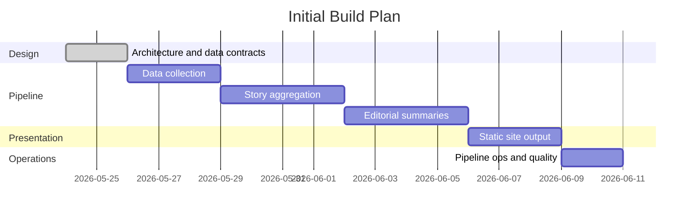

# Project Plan: news-tldr.com

This document tracks the phased buildout of the filesystem-backed RSS aggregator and static TL;DR news site.

## Current Direction

- **Pipeline**: Python with `feedparser`, `httpx`/`h2`, `trafilatura`, `beautifulsoup4`, standard-library `sqlite3`, and LLM client libraries.
- **Presentation**: Astro (or similar frontend-focused SSG) for static site generation.
- **State**: SQLite for pipeline state and incremental processing. JSON files for human-readable stage artifacts.
- **No database server** or application runtime for the published site.
- Filesystem JSON artifacts are the source of truth between stages.
- Pipeline stages: data collection, story aggregation, editorial, presentation.
- Data collection is implemented; next active work is story aggregation.
- Article digest generation is now its own runnable stage before story aggregation.
- The configured source catalog has 83 enabled sources, including AP News and MotorTrend custom scrapers.
- Neutrality, attribution, and auditability are first-class requirements.
- Pipeline runs hourly. Stories evolve as new articles arrive across runs.
- Events are the primary grouping unit. Optional thread tags link related events over time.

## Milestones

## Milestone Checklist

### [x] Milestone 0: Architecture & Data Contracts

- [x] Establish agent handoff structures (`AGENTS.md`, `README.md`, docs).
- [x] Decide on a filesystem-backed architecture.
- [x] Define the four pipeline stages.
- [x] Draft proposed JSON artifact layout and stage responsibilities.
- [x] Create initial repository structure for `config/`, `data/`, `site/`, and `dist/`.
- [x] Add `.gitignore` rules for generated/runtime directories.
- [x] Choose implementation language: Python (pipeline) + Astro (presentation).
- [x] Externalize categories to `config/categories.json`.
- [x] Define JSON sketches for article, event, and story artifacts.
- [x] Design pipeline state model (SQLite), incremental processing, and concurrency control.
- [x] Design HTTP client policy (UA string, rate limiting, politeness).
- [x] Define event model (flat events with optional thread tags, no topic registry).
- [x] Define political framing approach (neutral TL;DR + transparent left/right perspectives).

### [x] Milestone 1: Data Collection

- [x] Create seed feed config skeleton at `config/feeds.json`.
- [x] Populate seed feed config with real source IDs, feed URLs, category hints, and source policy metadata.
- [x] Create `config/pipeline.json` with operational defaults (rate limits, timeouts, retention, staleness threshold).
- [x] Create `config/source-policy.json` skeleton with bias labels and reliability metadata.
- [x] Set up Python virtual environment (`.venv`).
- [x] Scan dependencies using security tools, then set up Python project: `pyproject.toml`, dependencies (`feedparser`, `httpx`, `h2`, `trafilatura`, `beautifulsoup4`; SQLite via standard-library `sqlite3`).
- [x] Define SQLite schema and migration/versioning system, then initialize `data/state/pipeline.db` with feeds, articles, article fingerprints, events, pipeline runs, item errors, and LLM usage tables.
- [x] Implement atomic pipeline lock acquisition and release with verified process identity and watchdog timeout.
- [x] Implement RSS/Atom feed fetching with conditional requests (`If-Modified-Since`, `ETag`) and secure XML parsing (disable external entities).
- [x] Implement HTTP client with desktop Chrome UA, per-domain rate limiting, robots.txt respect, exponential backoff, and redirect-aware SSRF protection (validate scheme/host/port/resolved IP before each request and redirect).
- [x] Parse feed entries into normalized article JSON.
- [x] Implement article text extraction via `trafilatura` (or similar readability library) for partial feed entries.
- [x] Implement paywall detection signals and source-level paywall hints.
- [x] Implement deduplication by `article_id` (canonical URL hash, GUID fallback) against the state database.
- [x] Write per-article staging JSON files (atomic writes) keyed on publish date.
- [x] Fetch supported lead images from feed/scraper/article metadata and store same-stem image sidecars next to staged article JSON.
- [x] Register collected articles in the state database.
- [x] Write collection logs (`data/staging/fetch-log/`).
- [x] Add tests with fixture feeds, sample article pages, lock contention/stale-lock cases, and SSRF redirect/blocking cases.
- [x] Extend collection to support Custom Site Scrapers (e.g., AP News, MotorTrend) via `beautifulsoup4` for non-RSS sources.
- [x] Expand and verify the enabled feed catalog; keep source policy metadata aligned 1:1 with configured sources.
- [x] Add `collect --verbose` progress logging to stderr while preserving final stats JSON on stdout.
- [x] Route HTTP retry progress through the verbose progress callback instead of unconditional stderr output.
- [x] Add `clean-data --yes` to remove local generated collection state for a fresh run.

### [ ] Milestone 2: Story Aggregation

> Schema note: migrations in `pipeline/state.py` provision aggregation state:
> event keywords/entities/article counts/editorial timestamps/confidence,
> `aggregation_windows` for sliding-window idempotency, and event
> newsworthiness columns for global/category ranking. Further schema changes
> go in a new migration entry.

> Windowing note: aggregation uses sliding publish-time windows. The default is
> a 6-hour window with a 1-hour step, tracked in `aggregation_windows` so
> completed windows are not rerun on every pipeline pass. The newest completed
> window may be rerun on the next pass to absorb late articles near the overlap.
> By default, if no range is specified, aggregation and digestion processing starts
> from the start of the previous UTC day to avoid processing older retained staging data.

> Hosted LLM decision: Stage 2 aggregation will use the Gemini Developer API
> by default with an AI Studio key loaded from local `.env` as
> `GEMINI_API_KEY`. The default model is `gemini-3.1-flash-lite`
> (`GEMINI_MODEL`). May 24 local Ollama evaluation showed that local models
> could produce valid small-batch structured output, but larger clustering
> experiments were too slow for the pipeline's needs. Direct Gemini API smoke
> tests succeeded with structured JSON output for `gemini-2.5-flash-lite` and
> `gemini-3.1-flash-lite`.

- [x] Implement state database query for unprocessed articles (`event_id` is null).
- [x] Generate and persist per-article LLM digests before aggregation, including factual summaries, key facts, content-quality signals, article-level impact scores, prompt metadata, SQLite status tracking, and bounded parallel API calls.
- [x] Add standalone `digest --verbose` CLI stage so digest generation and impact scoring can be run and debugged before aggregation.
- [x] Normalize common article-impact scale mistakes from digest output, clamp contradictory low-signal impact scores, support forced digest regeneration, improve key-fact prompt guidance, and filter non-news/spammy/video-carousel plus low category-impact articles before aggregation.
- [x] Article-digest v3 prompt + cap rework (May 25, 2026): controlled `rationale_codes` vocabulary in the prompt; layered impact caps with per-axis minima (multi-topic 0.30, vendor_announcement asymmetric 0.55/0.75, unconfirmed_injury global-only 0.60, paywalled in the noisy-content set); optional `study_stage` schema field for research articles; tightened `novelty` semantics (research papers are `analysis`/`evergreen`, not `breaking`); tightened `scope` definition (actor reach, not topic reach); explicit `paywalled` vs `thin` discrimination; rule against leaking `published_at` metadata into summaries; advertorial labeling required for promotional non_news.
- [x] Add deterministic media-page filtering before aggregation using URL/path and collection signals, so obvious video/carousel pages are excluded even when the digest model summarizes a transcript as high-impact news.
- [x] Article-digest v6 hardening: deterministically filters stale estimated-date URL/live pages before LLM calls and code-gates `study_stage` persistence to covered biomedical/pharmaceutical/materials research contexts.
- [x] Implement near-duplicate detection for exact reprints (content text and canonical URL hashes). Headline-hash and summary-hash signals are stored in `article_fingerprints` for future use, but are intentionally not used to short-circuit digest generation because generic shared headlines would silently propagate one story's digest onto unrelated stories.
- [x] Implement Gemini Developer API client using stdlib HTTP, loading `GEMINI_API_KEY` and `GEMINI_MODEL` from `.env`/environment, with structured output, request timeouts, model/prompt metadata, and usage/timing capture.
- [x] Design window-based LLM prompt for story clustering (headline + brief paragraph summary + source + date) to identify articles and angles covering the same developing news subject.
- [x] Use compact order-preserving numeric enum output for the first pass; deterministic code maps rows back to input articles by position and rejects malformed or out-of-range values.
- [ ] Keep free-text generation out of the first pass. Generate event titles, slugs, keywords, entities, and optional thread tags in a second smaller validated call.
- [x] Implement LLM abstraction layer supporting the Gemini API default and future hosted/local model backends.
- [x] Implement classification: content type, category (validated against `config/categories.json`), and event assignment.
- [x] Implement sliding 6-hour aggregation windows with a 1-hour overlap and completed-window skip logic.
- [x] Implement event creation: generate `event_id` (date + deterministic headline slug in the first pass), validate uniqueness, store lightweight keywords, write event JSON.
- [x] Implement event merging: add articles to existing events when the LLM matches them.
- [x] Add newsworthiness scoring with global and category scores, preferring article-level digest impact to avoid extra LLM calls and falling back to deterministic or optional post-grouping LLM scoring when impact metadata is unavailable.
- [ ] Implement optional thread tag assignment for linking related events.
- [x] Filter standalone opinion content from event creation (opinions attach to existing events only).
- [x] Update event JSON files and state database after each window.
- [ ] Implement event status lifecycle: active → stale (48h no new articles) → archived.
- [x] Add deterministic validation for IDs, category values, enum values, confidence thresholds, window cardinality, and retry/fallback behavior.
- [x] Add tests for grouping and registry updates.

### [ ] Milestone 3: Editorial

- [ ] Implement state database query for events with new articles since last editorial run.
- [ ] Design per-event LLM prompt for neutral TL;DR generation with full article context.
- [ ] Generate story JSON from event article groups (one LLM call per event).
- [ ] Include source references for each key fact and uncertainty.
- [ ] Implement political framing extraction for clearly political events (left/right perspectives with source attribution).
- [ ] Refine story importance ranking using Stage 2 newsworthiness, source count, freshness, source quality, category, and editorial judgment.
- [ ] Write/update story JSON files with `llm_metadata` (model, prompt version, timestamp, input references).
- [ ] Generate `data/published/active-stories.json` index.
- [ ] Add tests for schema validation, citation coverage, and framing extraction.

### [ ] Milestone 4: Presentation

- [ ] Scan dependencies using security tools, then set up Astro project in `site/` with build output to `dist/`.
- [ ] Build main page with all active stories in a rolling time window, editorially ranked by importance.
- [ ] Implement category tabs (one per `config/categories.json` entry + "All" default) as client-side filters on the main story list.
- [ ] Build individual story pages with TL;DR, key facts, uncertainties, sources, and political framing, ensuring strict HTML escaping/sanitization for XSS prevention.
- [ ] Render source links with paywall indicators.
- [ ] Render political framing section (when present) with left/right perspective summaries and source links.
- [ ] Build archive pages or JSON indexes for older stories.
- [ ] Ensure output is fully static, CDN-cacheable, and requires no server runtime.
- [ ] Ensure the pipeline environment and state database are strictly isolated and not pushed to the public web hosting location.
- [ ] Add build verification for generated pages.
- [ ] Update `.gitignore` for `node_modules/` and Astro build artifacts.

### [ ] Milestone 5: Operations & Quality

- [x] Document that long-running pipeline commands must support `--verbose` progress/status logging to stderr.
- [ ] Add a single command (`make run`, `python -m pipeline`, or similar) to run the full pipeline locally.
- [ ] Verify pipeline lock, watchdog timeout, and stale lock recovery work end-to-end.
- [ ] Add prompt/version metadata to all LLM-generated artifacts.
- [ ] Add JSON schema validation command for all artifact types.
- [ ] Implement retention cleanup that compacts or removes old full article text while preserving article metadata, fingerprints, event assignments, and citation references.
- [ ] Add dry-run mode (skips LLM calls, useful for testing collection and aggregation logic).
- [ ] Track LLM token usage per run in the state database.
- [ ] Design scheduled-run configuration for cron, GitHub Actions, or another worker host.
- [ ] Add monitoring/alerting for failed feeds, extraction failures, watchdog kills, and malformed LLM outputs.
- [ ] Document how to add feeds, categories, and source policy metadata.

## Backlog

- Headless browser fallback for sources that block readability extraction.
- Additional hosted/local model backend support for aggregation and editorial stages.
- Manual review mode for high-impact stories before publishing.
- Bias/source policy import from a curated external source if licensing allows.
- Per-thread archive pages with event timelines.
- Search index generated at build time.
- Feed health dashboard generated as static HTML.
- Incremental Astro builds (skip unchanged story pages).
