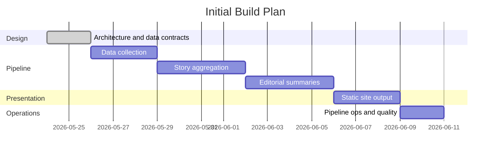

# Project Plan: news-tldr.com

This document tracks the phased buildout of the filesystem-backed RSS aggregator and static TL;DR news site.

## Current Direction

- **Pipeline**: Python with `feedparser`, `httpx`, `trafilatura`, standard-library `sqlite3`, and LLM client libraries.
- **Presentation**: Astro (or similar frontend-focused SSG) for static site generation.
- **State**: SQLite for pipeline state and incremental processing. JSON files for human-readable stage artifacts.
- **No database server** or application runtime for the published site.
- Filesystem JSON artifacts are the source of truth between stages.
- Pipeline stages: data collection, story aggregation, editorial, presentation.
- Neutrality, attribution, and auditability are first-class requirements.
- Pipeline runs hourly. Stories evolve as new articles arrive across runs.
- Events are the primary grouping unit. Optional thread tags link related events over time.

## Milestones

## Milestone Checklist

### [x] Milestone 0: Architecture & Data Contracts

- [x] Establish agent handoff structures (`AGENTS.md`, `README.md`, docs).
- [x] Decide on a filesystem-backed architecture.
- [x] Define the four pipeline stages.
- [x] Draft proposed JSON artifact layout and stage responsibilities.
- [x] Create initial repository structure for `config/`, `data/`, `site/`, and `dist/`.
- [x] Add `.gitignore` rules for generated/runtime directories.
- [x] Choose implementation language: Python (pipeline) + Astro (presentation).
- [x] Externalize categories to `config/categories.json`.
- [x] Define JSON sketches for article, event, and story artifacts.
- [x] Design pipeline state model (SQLite), incremental processing, and concurrency control.
- [x] Design HTTP client policy (UA string, rate limiting, politeness).
- [x] Define event model (flat events with optional thread tags, no topic registry).
- [x] Define political framing approach (neutral TL;DR + transparent left/right perspectives).

### [ ] Milestone 1: Data Collection

- [x] Create seed feed config skeleton at `config/feeds.json`.
- [x] Populate seed feed config with real source IDs, feed URLs, category hints, and source policy metadata.
- [x] Create `config/pipeline.json` with operational defaults (rate limits, timeouts, retention, staleness threshold).
- [x] Create `config/source-policy.json` skeleton with bias labels and reliability metadata.
- [ ] Scan dependencies using security tools, then set up Python project: `pyproject.toml`, virtual environment, dependencies (`feedparser`, `httpx`, `trafilatura`; SQLite via standard-library `sqlite3`).
- [ ] Define SQLite schema and migration/versioning system, then initialize `data/state/pipeline.db` with feeds, articles, article fingerprints, events, pipeline runs, item errors, and LLM usage tables.
- [ ] Implement atomic pipeline lock acquisition and release with verified process identity and watchdog timeout.
- [ ] Implement RSS/Atom feed fetching with conditional requests (`If-Modified-Since`, `ETag`) and secure XML parsing (disable external entities).
- [ ] Implement HTTP client with desktop Chrome UA, per-domain rate limiting, robots.txt respect, exponential backoff, and redirect-aware SSRF protection (validate scheme/host/port/resolved IP before each request and redirect).
- [ ] Parse feed entries into normalized article JSON.
- [ ] Implement article text extraction via `trafilatura` (or similar readability library) for partial feed entries.
- [ ] Implement paywall detection signals and source-level paywall hints.
- [ ] Implement deduplication by `article_id` (canonical URL hash, GUID fallback) against the state database.
- [ ] Write per-article staging JSON files (atomic writes) keyed on publish date.
- [ ] Register collected articles in the state database.
- [ ] Write collection logs (`data/staging/fetch-log/`).
- [ ] Add tests with fixture feeds, sample article pages, lock contention/stale-lock cases, and SSRF redirect/blocking cases.

### [ ] Milestone 2: Story Aggregation

- [ ] Implement state database query for unprocessed articles (`event_id` is null).
- [ ] Implement near-duplicate detection for exact reprints (headline similarity, exact text, or URL hashes).
- [ ] Design batched LLM prompt for article classification and event grouping (headline + brief paragraph summary + source + date + active events context with keywords/entities) to identify articles covering the same underlying story.
- [ ] Implement LLM abstraction layer supporting API models and local models.
- [ ] Implement batched classification: content type, category (validated against `config/categories.json`), and event assignment.
- [ ] Implement event creation: generate `event_id` (date + LLM-suggested slug), validate uniqueness, store keywords/entities, write event JSON.
- [ ] Implement event merging: add articles to existing events when the LLM matches them.
- [ ] Implement optional thread tag assignment for linking related events.
- [ ] Filter standalone opinion content from event creation (opinions attach to existing events only).
- [ ] Update event JSON files and state database after each batch.
- [ ] Implement event status lifecycle: active → stale (48h no new articles) → archived.
- [ ] Add deterministic validation for IDs, category values, and confidence thresholds.
- [ ] Add tests for grouping, deduplication, and registry updates.

### [ ] Milestone 3: Editorial

- [ ] Implement state database query for events with new articles since last editorial run.
- [ ] Design per-event LLM prompt for neutral TL;DR generation with full article context.
- [ ] Generate story JSON from event article groups (one LLM call per event).
- [ ] Include source references for each key fact and uncertainty.
- [ ] Implement political framing extraction for clearly political events (left/right perspectives with source attribution).
- [ ] Implement story importance scoring (source count, freshness, category, editorial judgment).
- [ ] Write/update story JSON files with `llm_metadata` (model, prompt version, timestamp, input references).
- [ ] Generate `data/published/active-stories.json` index.
- [ ] Add tests for schema validation, citation coverage, and framing extraction.

### [ ] Milestone 4: Presentation

- [ ] Scan dependencies using security tools, then set up Astro project in `site/` with build output to `dist/`.
- [ ] Build main page with all active stories in a rolling time window, editorially ranked by importance.
- [ ] Implement category tabs (one per `config/categories.json` entry + "All" default) as client-side filters on the main story list.
- [ ] Build individual story pages with TL;DR, key facts, uncertainties, sources, and political framing, ensuring strict HTML escaping/sanitization for XSS prevention.
- [ ] Render source links with paywall indicators.
- [ ] Render political framing section (when present) with left/right perspective summaries and source links.
- [ ] Build archive pages or JSON indexes for older stories.
- [ ] Ensure output is fully static, CDN-cacheable, and requires no server runtime.
- [ ] Ensure the pipeline environment and state database are strictly isolated and not pushed to the public web hosting location.
- [ ] Add build verification for generated pages.
- [ ] Update `.gitignore` for `node_modules/` and Astro build artifacts.

### [ ] Milestone 5: Operations & Quality

- [ ] Add a single command (`make run`, `python -m pipeline`, or similar) to run the full pipeline locally.
- [ ] Verify pipeline lock, watchdog timeout, and stale lock recovery work end-to-end.
- [ ] Add prompt/version metadata to all LLM-generated artifacts.
- [ ] Add JSON schema validation command for all artifact types.
- [ ] Implement retention cleanup that compacts or removes old full article text while preserving article metadata, fingerprints, event assignments, and citation references.
- [ ] Add dry-run mode (skips LLM calls, useful for testing collection and aggregation logic).
- [ ] Track LLM token usage per run in the state database.
- [ ] Design scheduled-run configuration for cron, GitHub Actions, or another worker host.
- [ ] Add monitoring/alerting for failed feeds, extraction failures, watchdog kills, and malformed LLM outputs.
- [ ] Document how to add feeds, categories, and source policy metadata.

## Backlog

- Headless browser fallback for sources that block readability extraction.
- Local-model support for aggregation and editorial stages.
- Manual review mode for high-impact stories before publishing.
- Bias/source policy import from a curated external source if licensing allows.
- Per-thread archive pages with event timelines.
- Search index generated at build time.
- Feed health dashboard generated as static HTML.
- Incremental Astro builds (skip unchanged story pages).
