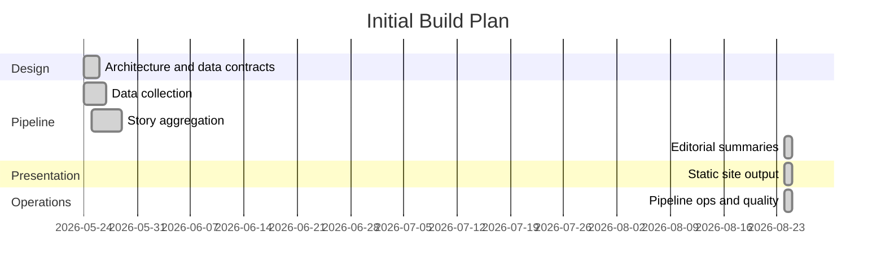

# Project Plan: news-tldr.com

This document tracks the phased buildout of the filesystem-backed RSS aggregator and static TL;DR news site.

## Current Direction

- **Pipeline**: Python with `feedparser`, pooled `httpx` HTTP/1.1 clients for collection and Gemini calls, `trafilatura`, `beautifulsoup4`, standard-library `sqlite3`, and LLM client libraries.
- **Presentation**: Dependency-free Python static renderer in `pipeline/present.py`.
- **State**: SQLite for pipeline state and incremental processing. JSON files for human-readable stage artifacts.
- **No database server**. Published news content remains static; the optional anonymous reader-sync endpoint is an isolated PHP-FPM/SQLite origin service.
- Filesystem JSON artifacts are the source of truth between stages.
- Pipeline stages: maintenance/retention, data collection, article digestion, story aggregation, editorial, presentation, production publish.
- All executable stages through production publish are implemented. The retained dataset, 433 editorial stories, and production presentation were refreshed through August 24, 2026; optional metadata/thread enhancements remain open.
- Article digest generation is now its own runnable stage before story aggregation.
- A maintenance stage now runs before collection in `pipeline run` to expire old pending work outside the configured staging horizon, restore prematurely expired in-horizon work, advance event lifecycle state, reconcile event artifacts, and compact old filtered/archived article JSON.
- The configured source catalog has 69 enabled sources, including AP News and MotorTrend custom scrapers.
- Neutrality, attribution, and auditability are first-class requirements.
- The pipeline supports hourly scheduling. Stories evolve as new articles arrive across runs, and every normal top-level run publishes the completed static build automatically.
- Events are the primary grouping unit. Optional thread tags link related events over time.

## Milestones

## Milestone Checklist

### [x] Milestone 0: Architecture & Data Contracts

- [x] Establish agent handoff structures (`AGENTS.md`, `README.md`, docs).
- [x] Decide on a filesystem-backed architecture.
- [x] Define the four pipeline stages.
- [x] Draft proposed JSON artifact layout and stage responsibilities.
- [x] Create initial repository structure for `config/`, `data/`, `site/`, and `dist/`.
- [x] Add `.gitignore` rules for generated/runtime directories.
- [x] Choose implementation language: Python for both the pipeline and dependency-free static presentation renderer.
- [x] Externalize categories to `config/categories.json`.
- [x] Define JSON sketches for article, event, and story artifacts.
- [x] Design pipeline state model (SQLite), incremental processing, and concurrency control.
- [x] Design HTTP client policy (UA string, rate limiting, politeness).
- [x] Define event model (flat events with optional thread tags, no topic registry).
- [x] Define political framing approach (neutral TL;DR + transparent left/right perspectives).

### [x] Milestone 1: Data Collection

- [x] Create seed feed config skeleton at `config/feeds.json`.
- [x] Populate seed feed config with real source IDs, feed URLs, category hints, and source policy metadata.
- [x] Create `config/pipeline.json` with operational defaults (rate limits, timeouts, retention, staleness threshold).
- [x] Create `config/source-policy.json` skeleton with bias labels and reliability metadata.
- [x] Set up Python virtual environment (`.venv`).
- [x] Scan dependencies using security tools, then set up Python project: `pyproject.toml`, dependencies (`feedparser`, `httpx`, `h2`, `trafilatura`, `beautifulsoup4`; SQLite via standard-library `sqlite3`).
- [x] Define SQLite schema and migration/versioning system, then initialize `data/state/pipeline.db` with feeds, articles, article fingerprints, events, pipeline runs, item errors, and LLM usage tables.
- [x] Implement atomic pipeline lock acquisition and release with verified process identity and watchdog timeout.
- [x] Implement RSS/Atom feed fetching with conditional requests (`If-Modified-Since`, `ETag`) and secure XML parsing (disable external entities).
- [x] Implement HTTP client with desktop Chrome UA, per-domain rate limiting, robots.txt respect, exponential backoff, and redirect-aware SSRF protection (validate scheme/host/port/resolved IP before each request and redirect).
- [x] Harden collection reliability by using HTTP/1.1 for the high-concurrency shared pool and retrying transient transport/protocol errors with bounded backoff.
- [x] Parse feed entries into normalized article JSON.
- [x] Implement article text extraction via `trafilatura` (or similar readability library) for partial feed entries.
- [x] Implement paywall detection signals and source-level paywall hints.
- [x] Implement deduplication by `article_id` (canonical URL hash, GUID fallback) against the state database.
- [x] Write per-article staging JSON files (atomic writes) keyed on publish date.
- [x] Initially fetched lead-image sidecars; retired image discovery/downloads after the licensing review so new collection runs are text-only while historical cleanup compatibility remains.
- [x] Register collected articles in the state database.
- [x] Write collection logs (`data/staging/fetch-log/`).
- [x] Add tests with fixture feeds, sample article pages, lock contention/stale-lock cases, and SSRF redirect/blocking cases.
- [x] Extend collection to support Custom Site Scrapers (e.g., AP News, MotorTrend) via `beautifulsoup4` for non-RSS sources.
- [x] Expand and verify the enabled feed catalog; keep source policy metadata aligned 1:1 with configured sources.
- [x] Add `collect --verbose` progress logging to stderr while preserving final stats JSON on stdout.
- [x] Route HTTP retry progress through the verbose progress callback instead of unconditional stderr output.
- [x] Add `clean-data --yes` to remove local generated pipeline state for a fresh run, including event and published artifacts.

### [x] Milestone 2: Story Aggregation

> Schema note: migrations in `pipeline/state.py` provision aggregation state:
> event keywords/entities/article counts/editorial timestamps/confidence,
> `aggregation_windows` for sliding-window idempotency, and event
> newsworthiness columns for global/category ranking. Further schema changes
> go in a new migration entry.

> Windowing note: aggregation uses chunked publish-time windows with overlap.
> The default is a 3-hour aggregation chunk plus a 1-hour overlap lookahead
> (4-hour LLM windows fixed to `00/03/06/09/12/15/18/21` UTC starts), tracked
> in `aggregation_windows` so completed windows are not rerun on every
> pipeline pass. Normal aggregation uses sparse planning: after computing the
> staging-retention bounds, it selects only fixed UTC window starts that have
> unassigned articles in their own publish-time bucket, plus the latest
> completed window when it falls in range. Forced aggregation remains
> continuous so reset coverage is explicit.
> By default, if no range is specified, aggregation and digestion start at the
> configured staging retention boundary (three UTC days by default). This keeps
> late-arriving articles from recovered feeds from being silently skipped.

> Hosted LLM decision: pipeline LLM stages use the Gemini Developer API with an
> AI Studio key loaded from local `.env` as `GEMINI_API_KEY`. Bulk work uses
> `gemini-3.5-flash-lite` (`GEMINI_BULK_MODEL`, with `GEMINI_MODEL` as a
> fallback); selective article-filter, editorial, and final deduplication adjudication use
> an ordered `gemini-3.7-flash` → `gemini-3.6-flash` → `gemini-3.5-flash`
> capacity fallback chain. Deduplication may use 3.5 Flash-Lite as a final
> non-authoritative fallback, but Lite cannot approve a merge. May 24 local Ollama evaluation showed that local models
> could produce valid small-batch structured output, but larger clustering
> experiments were too slow for the pipeline's needs. Direct Gemini API smoke
> tests succeeded, but hosted models remained the practical choice. August 24
> live evaluation and a full refresh validated structured output for both new
> model tiers.

- [x] Implement state database query for unprocessed articles (`event_id` is null).
- [x] Generate and persist per-article LLM digests before aggregation, including factual summaries, key facts, content-quality signals, article-level impact scores, prompt metadata, SQLite status tracking, and bounded parallel API calls.
- [x] Add standalone `digest --verbose` CLI stage so digest generation and impact scoring can be run and debugged before aggregation.
- [x] Normalize common article-impact scale mistakes from digest output, clamp contradictory low-signal impact scores, support forced digest regeneration, improve key-fact prompt guidance, and filter non-news/spammy/video-carousel plus low category-impact articles before aggregation.
- [x] Article-digest v3 prompt + cap rework (May 25, 2026): controlled `rationale_codes` vocabulary in the prompt; layered impact caps with per-axis minima (multi-topic 0.30, vendor_announcement asymmetric 0.55/0.75, unconfirmed_injury global-only 0.60, paywalled in the noisy-content set); optional `study_stage` schema field for research articles; tightened `novelty` semantics (research papers are `analysis`/`evergreen`, not `breaking`); tightened `scope` definition (actor reach, not topic reach); explicit `paywalled` vs `thin` discrimination; rule against leaking `published_at` metadata into summaries; advertorial labeling required for promotional non_news.
- [x] Add deterministic media-page filtering before aggregation using URL/path and collection signals, so obvious video/carousel pages are excluded even when the digest model summarizes a transcript as high-impact news.
- [x] Article-digest v6 hardening: deterministically filters stale estimated-date URL/live pages before LLM calls and code-gates `study_stage` persistence to covered biomedical/pharmaceutical/materials research contexts.
- [x] Implement near-duplicate detection for exact reprints (content text and canonical URL hashes). Headline-hash and summary-hash signals are stored in `article_fingerprints` for future use, but are intentionally not used to short-circuit digest generation because generic shared headlines would silently propagate one story's digest onto unrelated stories.
- [x] Implement Gemini Developer API client using pooled `httpx` HTTP/1.1 transport, loading `GEMINI_API_KEY` and `GEMINI_MODEL` from `.env`/environment, with structured output, request timeouts, model/prompt metadata, retry/backoff handling, and usage/timing capture.
- [x] Upgrade bulk LLM work to `gemini-3.5-flash-lite`, remove deprecated sampling parameters, and configure Gemini 3 thinking levels explicitly.
- [x] Add selective `gemini-3.7-flash` article-filter review for borderline/conflicting first-pass digests, with first/final decisions and both usage records preserved for audit.
- [x] Route the strict final event-pair merge decision to `gemini-3.7-flash` while retaining 3.5 Flash-Lite for candidate discovery and prescreening.
- [x] Align default digest and aggregation lookbacks with `retention.staging_article_days` so recovered feeds are processed across the full retained horizon.
- [x] Design window-based LLM prompt for story clustering (headline + brief paragraph summary + source + date) to identify articles and angles covering the same developing news subject.
- [x] Use compact order-preserving numeric enum output for the first pass; deterministic code maps rows back to input articles by position and rejects malformed or out-of-range values.
- [x] Keep the production grouping response compact and deterministically validated. The accepted launch design derives titles/slugs/keywords from source headlines and defers a separate metadata-generation call unless a future quality evaluation justifies its added cost.
- [x] Implement LLM abstraction layer supporting the Gemini API default and future hosted/local model backends.
- [x] Implement classification: content type, category (validated against `config/categories.json`), and event assignment.
- [x] Implement 3-hour aggregation chunks with a 1-hour overlap lookahead and completed-window skip logic.
- [x] Implement event creation: generate `event_id` (date + deterministic headline slug in the first pass), validate uniqueness, store lightweight keywords, write event JSON.
- [x] Implement event merging: add articles to existing events when the LLM matches them.
- [x] Add newsworthiness scoring with global and category scores, preferring article-level digest impact to avoid extra LLM calls and falling back to deterministic or optional post-grouping LLM scoring when impact metadata is unavailable.
- [x] Preserve optional thread fields in event/story contracts; automatic thread assignment is explicitly deferred as a post-launch enhancement rather than a launch requirement.
- [x] Filter standalone opinion content from event creation (opinions attach to existing events only).
- [x] Update event JSON files and state database after each window.
- [x] Implement event status lifecycle: active → stale (48h no new articles) → archived.
- [x] Add deterministic validation for IDs, category values, enum values, confidence thresholds, window cardinality, and retry/fallback behavior.
- [x] Add tests for grouping and registry updates.
- [x] Partition window articles and active events by Category Group prior to story aggregation, including bounded sub-batches for oversized groups, to prevent LLM attention breakdown and "mega-event" grouping errors in large windows.
- [x] Add deterministic post-validation grouping guardrails: split weakly connected headline groups, only preserve `existing_event_id` on matching components, treat null-like existing-event values as absent, and evaluate duplicate event candidates using article-headline similarity.
- [x] Parallelize aggregation LLM work safely: category batches within a window run concurrently, dedupe prescreen chunks and disjoint candidate-pair reviews run concurrently, and SQLite/event-file mutations remain serialized in deterministic order. Oversized dedupe prescreen batches repeat high-article-count anchor events across chunks, and `news_business` adds a parent-level cross-category prescreen so business/market reaction stories can still merge with the underlying world/U.S. event.

### [x] Milestone 3: Editorial

- [x] Implement state database query for events with new articles since last editorial run.
- [x] Design per-event LLM prompt for neutral TL;DR generation with bounded full-article context.
- [x] Generate story JSON from event article groups (one Gemini 3.7 Flash call per event).
- [x] Include validated source references for each key fact and uncertainty.
- [x] Implement political framing extraction for clearly political events, gated on both meaningful divergence and left/right source-policy coverage.
- [x] Refine story importance ranking using Stage 2 newsworthiness, source count, freshness, source quality, and editorial judgment.
- [x] Write/update story JSON files with `llm_metadata` (model, prompt version, timestamp, event input version).
- [x] Generate `data/published/active-stories.json` index for active and stale stories.
- [x] Add tests for schema validation, citation coverage, filtered-article exclusion, framing extraction, incremental selection, persistence, and index generation.

### [x] Milestone 4: Presentation

- [x] Implement a dependency-free Python static renderer in `pipeline/present.py` with build output to ignored `dist/`; no new dependency scan was needed.
- [x] Build the main page with all active stories in a configurable rolling window, editorially ranked by importance.
- [x] Implement category tabs (one per `config/categories.json` entry + "All" default) as client-side filters on the main story list.
- [x] Build individual story pages with TL;DR, key facts, uncertainties, sources, and political framing, with strict HTML escaping and URL allowlisting for XSS prevention.
- [x] Render source links with paywall indicators.
- [x] Render political framing (when present) with left/right perspective summaries and source links.
- [x] Build an active-story archive, sitemap, robots file, 404 page, and lightweight JSON API indexes.
- [x] Ensure output is fully static, cacheable, and requires no application runtime.
- [x] Enforce a strict Content Security Policy and keep all CSS/JavaScript same-origin, with no external asset dependencies requiring SRI.
- [x] Keep the pipeline environment and state database isolated; publish only managed files from `dist/` to the public web root.
- [x] Add build, XSS/path validation, safe deployment, stale managed-file cleanup, and CLI integration tests.
- [x] Keep generated `dist/` ignored by git.
- [x] Publish the current 433-story site to `/var/www/news-tldr.com/` and verify the homepage, story pages, and JSON API over HTTPS.

### [x] Milestone 5: Operations & Quality

- [x] Document that long-running pipeline commands must support `--verbose` progress/status logging to stderr.
- [x] Add a single command (`./.venv/bin/python -m pipeline.cli run`) to run the completed pipeline stages locally.
- [x] Add a standalone `maintenance --verbose` stage and run it at the start of the completed pipeline.
- [x] Run presentation after editorial and automatically publish successful builds to the configured production directory; support `run --no-publish` and `present --build-only` for safe previews.
- [x] Verify pipeline lock, watchdog timeout, live-process termination, zombie-process handling, and stale lock recovery end-to-end.
- [x] Add and audit prompt/version metadata on all LLM-generated article, event, story, aggregation-window, usage, and editorial artifacts.
- [x] Add `validate-data --verbose` structural schema/provenance/cross-reference validation for config, SQLite, article/event/story/index artifacts, and static output.
- [x] Implement retention cleanup that compacts old filtered/archived full article text while preserving article metadata, fingerprints, event assignments, digest metadata, and citation references.
- [x] Add durable per-source collection accounting (`source_run_stats` plus article `collection_run_id`) for long-term source-yield analysis.
- [x] Add non-mutating `run --dry-run` preflight and plan-only aggregation dry-run; both make zero network/LLM calls and perform no database, artifact, or publish mutations.
- [x] Track LLM token usage by run/stage/model/prompt in SQLite and expose `llm-usage --hours N` reporting.
- [x] Add and install an hourly cron schedule using `scripts/run-scheduled.sh`, with a reproducible entry in `deploy/cron/news-tldr.cron`.
- [x] Add `health --verbose` monitoring for stale/failed stages, feed/article failures, stale running jobs, malformed artifacts, SQLite integrity, and live HTTPS output; scheduled failures exit nonzero for cron alerting and retain rotating logs plus `health.json`.
- [x] Document how to add feeds, categories, and source policy metadata.
- [x] Prevent sparse-window replays from refreshing unchanged event timestamps and triggering unnecessary hourly editorial regeneration.
- [x] Add capacity-aware full-Flash fallbacks with per-model cooldown circuits; allow a deduplication-only Lite fallback that cannot authorize merges.
- [x] Cache final deduplication reviews by event input versions and bound production review work to the newest 40 pairs and one pass per run.
- [x] Snapshot the retained queue after maintenance and run collection concurrently with backlog processing; restrict prior digest/aggregation work to the snapshot boundary, checkpoint fetched articles even when backlog remains, and defer only their downstream admission.

### [x] Post-launch Reader Polish

- [x] Add concise category navigation labels that fit in one desktop row while preserving full category names elsewhere.
- [x] Add freshness-aware homepage and category-specific display ranks, with category views re-sorted by vertical impact.
- [x] Add a device-local New/All revisit control using a 10-second visibility threshold and three-day retention.
- [x] Add restrained source/category tinting with depth informed by story rank and distinct source count.
- [x] Default the global New/All preference to New and persist the reader's choice across visits and category sections.
- [x] Keep focused sections neutral while grouping combined-view colors into muted category families with source-count depth.
- [x] Prevent search indexing without blocking social preview fetches; add noindex metadata and complete Open Graph/X cards with a branded poster.
- [x] Keep the homepage freshness line compact with count and a client-refreshed
  relative build time.
- [x] Mark stories read after one second of title visibility, show a subtle read
  state, and re-apply the current local read set when category/view filters change.
- [x] Add a current-view Mark Read header action without adding a redundant unread action.
- [x] Add validated AI homepage curation with a distinct 12-story Top News list,
  specific multi-story topic sections across All/category views, and Everything Else fallback.
- [x] Collapse curated sections behind tappable, counted headings on mobile and
  provide an Expand All/Collapse All action for the current view.
- [x] Order recent topic groups with category-normalized source breadth, capped
  same-publisher angle depth, and a smaller editorial-rank allowance; preserve
  curated Top News placement inside focused categories.
- [x] Prioritize strong slug/title/headline duplicate candidates ahead of broad
  deduplication prescreen candidates inside the bounded review queue.
- [x] Add a device-local Top/All source-coverage filter, default it to Top, and
  define Top as stories covered by at least two distinct sources.
- [x] Keep the category and Latest Briefing rows in one sticky toolbar and
  return to the page top when the selected category changes.
- [x] Check in the production Nginx virtual host and give generated HTML a
  10-minute browser/Cloudflare cache lifetime.
- [x] Content-fingerprint generated CSS and JavaScript, cache hashed assets for
  one year, and retain prior/legacy paths for cached HTML during deployments.
- [x] Add a checked-in multi-resolution newspaper favicon and reference it from
  every generated page.
- [x] Add opt-in anonymous cross-browser read-history sync using a private URL
  fragment capability, atomic three-day state union, debounced writes,
  a single pre-display refresh, non-rerendering background writes, local
  disconnect, and explicit shared-state deletion.
- [x] Add a same-origin PHP/SQLite sync service isolated from pipeline state and
  the document root, with hashed tokens, strict schema/origin validation, daily
  retention cleanup, and a portable three-endpoint API contract.
- [x] Contain the sync origin with daily/total group ceilings, bounded reads and
  payloads, a 256 MiB SQLite page cap, layered Nginx rate/connection/body limits,
  and a dedicated three-worker PHP-FPM pool.

## Backlog

- Headless browser fallback for sources that block readability extraction.
- Additional hosted/local model backend support for aggregation and editorial stages.
- Manual review mode for high-impact stories before publishing.
- Bias/source policy import from a curated external source if licensing allows.
- Per-thread archive pages with event timelines.
- Search index generated at build time.
- Feed health dashboard generated as static HTML.
- Historical archived-event pages beyond the current active/stale story archive.
- Incremental presentation builds (skip unchanged story pages).
- Optional dedicated event metadata-generation pass and automatic thread assignment, pending a post-launch quality/cost evaluation.
